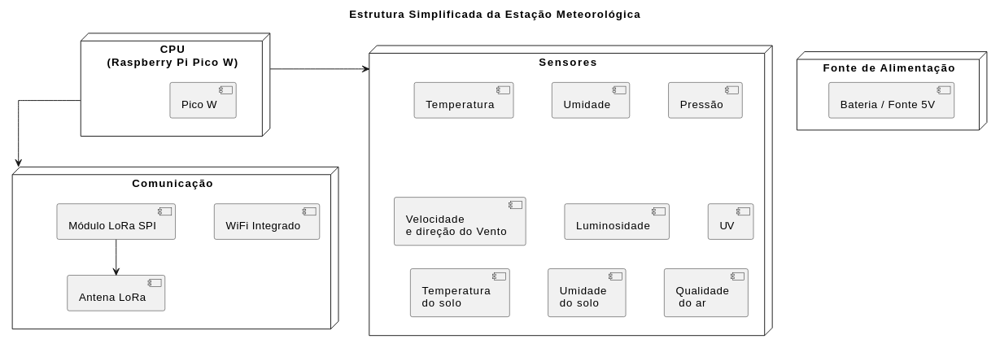

# EMBARCATECH - FASE 2

## PROJETO FINAL - ESTAÇÃO METEOROLÓGICA

Autores: Carlos Martinez Perez e Ricardo Jorge Furlan

## ETAPA 2 - 08/08/2025:

Nessa etapa, será realizada a definição da Arquitetura e a Modelagem do projeto. O objetivo é apresentar a proposta de arquitetura do sistema, incluindo o diagrama de hardware, os blocos funcionais e o fluxograma do software.  
   
---

### DIAGRAMA ESTRUTURAL

  
**Figura 1:** Diagrama Estrutural
  
### EXPLICAÇÃO SOBRE A ESTRUTURA

A estrutura da estação meteorológica é organizada em módulos funcionais, conforme ilustrado no Diagrama Estrutural na Figura 1.  

- CPU (Central Processing Unit) - Raspberry Pi Pico W:  
Este é o coração do sistema. O Pico W é responsável por orquestrar todas as operações, incluindo a leitura dos dados brutos dos sensores, o processamento inicial desses dados, o armazenamento temporário (se necessário) e a gestão da comunicação para o envio das informações. Ele atua como o cérebro da estação, garantindo que os dados sejam coletados e preparados para transmissão de forma eficiente.  

- Sensores:  
Este bloco agrupa todos os dispositivos responsáveis pela coleta de dados ambientais. A modularidade dos sensores permite a fácil adição ou substituição de componentes para atender a necessidades específicas. Os tipos de sensores representados incluem:  

    - Temperatura  
    - Umidade (do ar)  
    - Pressão  
    - Velocidade e Direção do Vento  
    - Luminosidade  
    - UV (Radiação Ultravioleta)  
    - Temperatura do Solo  
    - Umidade do Solo  
    - Qualidade do Ar  

Esses sensores fornecem os dados brutos que descrevem o microclima e as condições do solo.  

- Comunicação:  
Este módulo é fundamental para a transmissão dos dados coletados para um servidor remoto. Ele incorpora as tecnologias de conectividade que permitem à estação enviar as informações de forma confiável. Os componentes destacados são:  

    - Módulo LoRa SPI e Antena LoRa : Representam a opção de comunicação de longo alcance e baixo consumo de energia, ideal para áreas rurais sem infraestrutura Wi-Fi densa.  
    - WiFi Integrado : Sendo a comunicação primária, o Wi-Fi presente no Raspberry Pi Pico W, permite a conexão direta com redes locais ou roteadores para acesso à internet.  

- Fonte de Alimentação:  
Este bloco garante a autonomia energética da estação, um requisito fundamental para a operação em campo. Ele representa a capacidade de fornecer energia contínua ao sistema. Na figura aparecem:  
    
    - Bateria / Fonte 5V : Indicando que a estação pode ser alimentada por uma fonte externa de 5V ou, para autonomia, por um sistema de bateria, que pode ser recarregável por energia solar.  

Apresentam-se, a seguir, mais detalhes da estrutura do projeto.  

  
**Figura 2:** Diagrama de Blocos da Estação Meteorológica  

A figura 2 ilustra o **Diagrama de Blocos da Estação Meteorológica**, delineando a arquitetura modular proposta para o projeto. Cada bloco representa um subsistema chave, interconectado para garantir a funcionalidade completa do dispositivo. Essa organização modular, requisito primordial do projeto, é fundamental para a flexibilidade do desenvolvimento, a facilidade de manutenção e a escalabilidade futura, permitindo que novos sensores ou módulos sejam integrados de forma eficiente. O diagrama serve como um mapa visual da estrutura lógica do sistema, guiando a implementação e o entendimento das interações entre os componentes.  

  
**Figura 3:** Fluxo de Dados e Energia  
  
A figura 3 detalha o **Diagrama de Blocos da Estação Meteorológica**, com a representação esquemática que ilustra a interconexão funcional dos principais subsistemas do projeto. Este diagrama ajuda a visualizar a arquitetura modular da estação e o fluxo de dados e energia entre os distintos módulos da estação meteorológica.  

  
**Figura 4:** Estrutura Modular de Energia  

A figura 4 apresenta a **Estrutura Modular de Energia**, ilustrando as conexões e interações entre os subsistemas de gerenciamento de energia, ressaltando o foco do projeto na autonomia energética, mesmo em locais remotos.  

Cada bloco tem as seguintes funções:  

- **Fontes de Energia Primária:** as fontes de energia representam diferentes formas de geração elétrica, permitindo diversificação de entrada e assegurando o funcionamento da estação em diferentes cenários ambientais.  
- **Painel Solar:** geração fotovoltaica baseada em incidência de luz solar. Ideal para locais abertos com boa exposição solar. Deve ser dimensionado para suprir o consumo da estação e recarregar a bateria.  
- **Gerador Eólico:** utiliza a força do vento para gerar energia. Complementa o painel solar em dias nublados ou períodos noturnos com boa ventilação.  
- **Célula de Combustível:** conversão de energia química (etanol, hidrogênio, etc.) em eletricidade. Opção de alta autonomia e baixo impacto ambiental. Útil como backup em ocasiões de baixa insolação e vento.  
- **Rede Elétrica Convencional:** fonte direta de 127/220V AC com conversão para carga DC. Pode ser usada em propriedades com infraestrutura elétrica instalada como fonte principal ou redundante.  
- **Carregadores de Bateria:** cada fonte primária possui um carregador de bateria dedicado, responsável por:
    - Controlar a tensão e corrente de carga.  
    - Evitar sobrecarga ou descarga profunda.  
    - Isolar eletricamente fontes diferentes.  
Esses módulos são otimizados conforme a natureza da fonte:  
        - MPPT (Maximum Power Point Tracking) para painéis solares.  
        - Reguladores lineares ou buck/boost para rede elétrica e célula combustível.  

- **Bateria Secundária 12V:** atua como reserva central de energia, mantém a alimentação da estação quando as fontes primárias não estão gerando energia. Deve ser de tecnologia recarregável, preferencialmente LiFePO₄ ou AGM (Absorbent Glass Mat), que oferecem boa estabilidade térmica e número de ciclos e com capacidade (Ah) dimensionada para no mínimo 7 dias de autonomia contínua.  

- **Regulador 12V → 5V:** responsável por fornecer tensão estável de 5V DC, compatível com a maioria dos componentes do sistema. Deve ser eficiente (preferência por reguladores comutados tipo buck converter) para minimizar perdas por aquecimento.  

- **Saída 5V:** ponto final da cadeia de energia, entregando a tensão necessária para os módulos do sistema. Pode incluir proteções adicionais, como polyswitch (PTC) para sobrecorrente, TVS diodes para surtos de tensão, além de filtros LC para estabilidade e eliminação de ruído.  

- **Considerações Técnicas e de Projeto:**  
    - Eficiência Energética: a escolha de fontes e reguladores prioriza o baixo consumo e alta eficiência energética, fator essencial para operação ininterrupta no campo.  
    - Escalabilidade: o sistema permite a inclusão de novas fontes ou substituição de módulos sem afetar o funcionamento geral, favorecendo manutenção e expansão.  
    - Monitoramento: opcionalmente, sensores de tensão e corrente podem ser integrados à CPU para monitorar o estado de carga da bateria e alertar o servidor em caso de falhas.  

  
**Figura 5:** Estrutura do Canal de Comunicação Wi-Fi  

O canal Wi-Fi é o meio principal de comunicação da estação meteorológica com o mundo externo, sendo responsável por transmitir os dados coletados para um **servidor remoto** via internet. Ele explora os recursos nativos do **Raspberry Pi Pico W**, que já integra módulo Wi-Fi 802.11 b/g/n, garantindo simplicidade de hardware e conectividade eficiente. Os blocos funcionais do Canal Wi-Fi, são:
- **Raspberry Pi Pico W:**  
    - Atua como ponto central de coleta, processamento e transmissão dos dados.  
    - Lê os sensores periodicamente, organiza os dados (brutos e processados) e prepara os pacotes de comunicação.  
    - Realiza a conexão Wi-Fi com SSID e senha configuráveis via firmware.  
    - Implementa protocolo MQTT, HTTP REST ou WebSocket (definir), conforme definido na fase de integração com o backend.  

- **Roteador Wi-Fi / Hotspot:**  
    - Dispositivo intermediário que fornece acesso à internet.  
    - Pode ser um roteador doméstico ou hotspot 4G/5G.  
    - Atua como gateway entre a rede local (LAN) e a internet pública.  

- **Servidor Remoto:**  
    - Recebe os dados da estação para visualização, armazenamento e análise.  
    - Pode estar implementado em nuvem (ex: AWS, GSP, Azure, Heroku) ou em um servidor próprio ("on premises").  
    - Compatível com plataformas de dashboards como **Grafana**, que acessa os dados via banco de dados (InfluxDB, PostgreSQL etc.).  
    - Também pode expor uma API REST para integração com sistemas de terceiros.  

Outros aspectos importantes relativos ao canal de comunicação, são:  
- **Segurança e Confiabilidade:**  
    - **Criptografia TLS (opcional):** pode ser implementada para proteger os dados transmitidos.  
    - **Reconexão automática:** o firmware do Pico W deve implementar lógica de reconexão automática em caso de perda de sinal.  
    - **Fallback local:** se o Wi-Fi estiver indisponível, os dados podem ser armazenados localmente no cartão SD, garantindo que nenhuma medição seja perdida.  

- **Vantagens:**  
    - **Alta taxa de transmissão**, ideal para dados contínuos e históricos.  
    - **Compatível com redes residenciais e empresariais.**  
    - **Baixo custo de implementação**, pois não exige hardware adicional além do Pico W.  

  
**Figura 6:** Estrutura do Canal de Comunicação LoRa  

O **canal LoRa (Long Range)** representa uma alternativa de comunicação de **longo alcance e baixo consumo energético**, ideal para locais onde **não há cobertura Wi-Fi** confiável. Ele é especialmente indicado para aplicações rurais e remotas e atua como canal **secundário** ou complementar de envio de dados na estação meteorológica. Seus blocos funcionais são descritos a seguir:  
- **Raspberry Pi Pico W:**  
    - Responsável pela coleta dos dados dos sensores.  
    - Usa a interface **SPI** para se comunicar com o módulo LoRa externo (ex: SX1276/SX1278).  
    - Monta os pacotes de dados e envia periodicamente via LoRa.  
    - Pode implementar uma lógica de fallback: se o Wi-Fi falhar, o LoRa é ativado e se ambos falharem armazena os dados localmente no cartão SD.  

- **Módulo LoRa + Antena:**  
    - Dispositivo físico que implementa o protocolo LoRa (modulação, controle de potência, canal etc.).  
    - Conectado via SPI à CPU.  
    - A antena deve ser posicionada com boa visibilidade e isolamento para maximizar o alcance (até vários quilômetros, dependendo do ambiente).        
    - Frequência usada no Brasil: **915 MHz**.  

- **Gateway LoRa:**  
    - Dispositivo receptor que escuta os pacotes LoRa enviados pela estação.  
    - Pode ser dedicado (ex: RAK831, Dragino) ou construído com outro Pico W, ESP32 ou Raspberry Pi com módulo LoRa.  
    - Conectado a um roteador ou modem com acesso à internet.  
    - Realiza o "salto" dos dados da rede LoRa para a internet via Wi-Fi, Ethernet ou 4G.  

- **Servidor Remoto**  
    - Mesma função da estrutura Wi-Fi: recebe, armazena e exibe os dados em dashboards, como Grafana.  
    - Pode processar os dados recebidos diretamente do gateway ou via **rede LoRaWAN**, se houver um backend com protocolo como **The Things Stack**.  

Há algumas considerações técnicas e estratégicas que são dignas de nota:
    - **Alcance:** pode chegar a **10 km em campo aberto**, com consumo muito menor que Wi-Fi.  
    - **Baixo consumo:** ideal para dispositivos alimentados por energia solar ou baterias.  
    - **Baixa taxa de dados:** o LoRa transmite pequenos pacotes (tipicamente até 255 bytes), o que é suficiente para leituras periódicas de sensores.  
    - **Robustez:** funciona bem em áreas sem cobertura celular ou Wi-Fi.  

O projeto da estação meteorológica considera um modelo **híbrido**, ou seja:
    - Usa **Wi-Fi como canal primário** (alta taxa e velocidade).  
    - Usa **LoRa como canal secundário ou redundante**, quando o Wi-Fi falhar ou for insuficiente.  
    - Permite comunicação **assíncrona e resiliente**, garantindo que os dados cheguem ao destino mesmo em situações adversas.  

  
**Figura 7:** Estrutura de Armazenamento Local  

A estrutura de armazenamento local é responsável por **registrar os dados ambientais coletados** pela estação meteorológica em **memória não volátil**, permitindo a retenção mesmo sem conectividade com o servidor remoto. Essa funcionalidade é essencial para garantir **resiliência**, **confiabilidade** e **continuidade** no registro dos dados.  Os blocos funcionais do Armazenamento Local, são:  
- **Raspberry Pi Pico W:**  
    - Coleta dados dos sensores a cada intervalo definido (ex: 10 segundos).  
    - Organiza os dados em estruturas (ex: arquivos CSV, binários ou JSON).  
    - Realiza o salvamento dos dados em memória local via barramento SPI (usualmente).  

- **Módulo de Cartão MicroSD:**  
    - Utiliza comunicação SPI com o Pico W.  
    - Permite escrita e leitura em arquivos do sistema FAT32, que podem ser acessados facilmente em PCs.  
    - Armazena os seguintes tipos de dados:  
        - Leituras brutas (alta frequência)  
        - Médias temporais (10min, 12h, 24h)  
        - Logs de erro de sensores  
        - Estados do sistema (nível de bateria, status da conexão etc.)  
        - Suporta arquivos de log contínuo com rotação por data/hora.

- **Vantagens da Arquitetura:**  
    - **Continuidade de operação**: garante que nenhuma leitura se perca em caso de falhas na comunicação (Wi-Fi ou LoRa).  
    - **Facilidade de acesso local**: o cartão SD pode ser removido e lido diretamente em qualquer computador.  
    - **Flexibilidade de formatos**: permite salvar os dados em formatos customizados para diferentes aplicações.  

- **Considerações Técnicas:**  
    - Recomenda-se **uso de bibliotecas otimizadas** para SD (ex: FatFS ou pico\_sd\_card).  
    - É importante prever verificação de integridade (checksums) e estratégias de **rotação de arquivos** para evitar excesso de escrita em um mesmo setor do cartão (aumentando a vida útil).  

A estrutura de armazenamento local é especialmente útil em contextos onde a comunicação pode ser **intermitente** ou **indisponível por longos períodos**, como zonas rurais ou remotas. Ela forma o elo de segurança da arquitetura, garantindo a **persistência dos dados ambientais**.  

  
**Figura 8:** Estrutura de Monitoramento Remoto  

Esta estrutura representa como os dados fluem para que o usuário possa ter acesso a eles via internet.

- **Container Node.JS:**  
    - É o ponto de acesso pelo qual o dispositivo IoT enviará os dados.

- **Container PostgreSql:**  
    - Armazena os dados Recebidos

- **Container Grafana:**  
	- Gera os DashBoards

---

### FLUXOGRAMA DO SOFTWARE

A **Figura 9** apresenta a *estrutura lógica do código da CPU* da estação meteorológica, modelada para explorar os dois núcleos disponíveis no microcontrolador **RP2040** presente no Raspberry Pi Pico W. O diagrama ilustra a divisão funcional entre os núcleos 0 e 1, bem como a interação com a memória compartilhada, responsável por armazenar dados, ponteiros e parâmetros de configuração. Essa organização visa maximizar a eficiência do sistema, permitindo o processamento paralelo e a separação clara entre tarefas críticas de aquisição e rotinas de comunicação.  

  
**Figura 9:** Fluxograma do Código da CPU  

Os blocos mais importantes da figura incluem: no **Núcleo 0**, a inicialização do Núcleo 1 e o controle da comunicação remota, operando em um loop contínuo após configurar os drivers. No **Núcleo 1**, destacam-se a inicialização dos sensores e a configuração da interrupção de aquisição, que permite leituras em tempo real sem bloqueios. A **memória compartilhada** atua como elo entre os dois núcleos, garantindo o acesso sincronizado aos dados coletados e parâmetros de configuração da estação, o que é essencial para a robustez e confiabilidade da operação multitarefa.  

A **Figura 10** ilustra o *fluxograma da estrutura principal do Núcleo 0* do microcontrolador RP2040, responsável por gerenciar a comunicação externa da estação meteorológica, a interação com o Núcleo 1 e o controle de integridade do sistema via watchdog. Esse núcleo é encarregado pelas tarefas de supervisão e transmissão de dados, funcionando continuamente em loop e garantindo que a estação esteja sempre conectada e sincronizada com o servidor ou gateway, além de coordenar o envio das mensagens processadas.  

  
**Figura 10:** Fluxograma para o Núcleo 0  

Entre os elementos mais relevantes da figura estão: a **verificação e ativação do link de comunicação**, o **gerenciamento de mensagens recebidas e transmitidas**, e a **sincronização com o Núcleo 1** por meio de mensagens internas. Destaca-se também o controle do **WatchDog**, que garante a reinicialização do sistema caso ele entre em estado de falha ou travamento. A estrutura implementa verificações para confirmar se o link está ativo, se há mensagens a enviar, e se estas foram efetivamente transmitidas, com tentativas de reenvio em caso de falha, demonstrando uma lógica resiliente e adequada a ambientes com conectividade intermitente.  

As **Figuras 11 e 12** apresentam os *fluxograma da estrutura principal do Núcleo 1* do microcontrolador. Esse núcleo é responsável pela aquisição e preparação dos dados dos sensores, leitura dos parâmetros da estação e atualização da memória Flash. Além disso, realiza o controle dos contadores de eventos (como anemômetro e pluviômetro), a configuração das interrupções de leitura e o encaminhamento de mensagens com dados ambientais para o Núcleo 0, que se encarrega da transmissão externa.  

  
**Figura 11:** Fluxograma para o Núcleo 1 (básico)  

As principais características do diagrama incluem: a **inicialização dos sensores I2C, I1C e entradas analógicas**, a **inicialização da interrupção de aquisição de dados** (que permite capturas precisas e não bloqueantes), e a **detecção de solicitações do Núcleo 0** para alteração dos parâmetros da estação, os quais são gravados na Flash. Destaca-se também a **lógica de tratamento de mensagens pendentes**, com verificações de envio e o uso de uma **estrutura FIFO circular**, que assegura a ordenação das mensagens e sua transferência controlada. Ao final de cada ciclo, o watchdog é atualizado, contribuindo para a estabilidade e segurança do sistema.  

A **Figura 12** apresenta o *fluxograma da rotina de interrupção de aquisição de dados* executada no **Núcleo 1** da estação meteorológica. Essa rotina é acionada periodicamente, com o objetivo de realizar a coleta das variáveis ambientais em instantes precisos. A interrupção é responsável por reunir todas as leituras instantâneas, estruturá-las e prepará-las para posterior envio ao servidor via o Núcleo 0.  

  
**Figura 12:** Fluxograma para o Núcleo 1 (interrupções)  

Entre as etapas mais relevantes, destacam-se: a **leitura dos sensores**, segmentada por protocolo — **I2C**, **I1C**, e **analógicos** — além da **leitura e reinicialização do contador de pulsos**, utilizado para sensores como anemômetros ou pluviômetros. Após a leitura, os dados são organizados em uma estrutura padrão e gravados no **buffer circular na memória Flash**, o que garante o registro cronológico e persistente. Em seguida, um **flag de disponibilidade de dados** é ativado, permitindo que o fluxo principal do Núcleo 1 prepare a transmissão. Por fim, os dados mais recentes são utilizados para **atualizar o display local**, fornecendo feedback imediato ao usuário. Essa abordagem garante precisão, reatividade e confiabilidade na aquisição dos dados ambientais.

### PRINCIPAIS CONEXÕES E GPIOS UTILIZADOS

| Componente | Interface | Conector | GPIO |
| :-: | :-: | :-: | :-: |
| BME680               | I2C   | I2C1 | 02 e 03|
| BME280               | I2C   | I2C1 | 02 e 03|
| BMP280               | I2C   | I2C1 | 02 e 03|
| ATH10                | I2C   | I2C1 | 02 e 03|
| Anemômetro - HMC5883 | I2C   | I2C1 | 02 e 03|
| Anemômetro - HALL    | Pulse | IDC  | 09 |
| Biruta - HMC5883     | I2C   | I2C1 | 02 e 03|
| Pluviômetro - HALL   | Pulse | I2C0 | 01|
| BH1750               | I2C   | I2C1 | 02 e 03|
| GY33                 | I2C   | I2C1 | 02 e 03|
| DS1307               | I2C   | I2C1 | 02 e 03|
| DS3231               | I2C   | I2C1 | 02 e 03|
| Memory card          | SIO   | IDC  | Cartão de expansão |
| AD card              | SIO   | IDC  | Cartão de expansão |  
| LoRA card            | SIO   | IDC  | Cartão de expansão |  

Componentes com saída analógica utilizarão o AD Card.
Obs.: As portas analógicas serão configuráveis por software

| Componente | Função |
| :-: | :-: |
| LM35       | Temperatura |
| GUVA-S12SD | UV |
| SEN0193    | Umidade do solo |
| MQ-131     | Qualidade do Ar: ozônio |
| MICS-6814  | Qualidade do Ar: CO, NH3, NO2 |
| NHZ-14A    | Qualidade do Ar - CO2 |

---

### Obs.: A concepção geral da estação, apresentada acima, foi desenvolvida com uma arquitetura altamente modular, visando facilitar futuras expansões e manutenções. No entanto, nesta etapa inicial do projeto, e em função das limitações temporais, será implementado apenas o subconjunto mínimo necessário para assegurar a funcionalidade básica do sistema.
