# 📑 Relatório Final – Estação Meteorológica para o Agronegócio e a Agricultura Familiar

**Projeto Final - Etapa 4 (18/09/2025)**

**Autores: Carlos Martinez Perez e Ricardo Jorge Furlan**

---

## Índice

- [📑 Relatório Final – Estação Meteorológica para o Agronegócio e a Agricultura Familiar](#-relatório-final--estação-meteorológica-para-o-agronegócio-e-a-agricultura-familiar)
  - [Índice](#índice)
  - [1. Introdução](#1-introdução)
  - [2. Objetivos do Projeto](#2-objetivos-do-projeto)
    - [Objetivo Geral](#objetivo-geral)
    - [Objetivos Específicos](#objetivos-específicos)
  - [3. Metodologia](#3-metodologia)
    - [3.1 Levantamento de requisitos](#31-levantamento-de-requisitos)
    - [3.2 Escolha dos componentes](#32-escolha-dos-componentes)
    - [3.3 Planejamento do desenvolvimento](#33-planejamento-do-desenvolvimento)
      - [3.3.1 Projeto e montagem do hardware](#331-projeto-e-montagem-do-hardware)
      - [3.3.2 Desenvolvimento do firmware](#332-desenvolvimento-do-firmware)
      - [3.3.3 Implantação e configuração do servidor](#333-implantação-e-configuração-do-servidor)
      - [3.3.4 Integração e testes end-to-end](#334-integração-e-testes-end-to-end)
      - [3.3.5 Visualização e uso com Grafana](#335-visualização-e-uso-com-grafana)
      - [3.3.6 Aspectos transversais e gerência do projeto](#336-aspectos-transversais-e-gerência-do-projeto)
  - [4. Arquitetura geral do sistema](#4-arquitetura-geral-do-sistema)
    - [4.1 Diagrama da Arquitetura](#41-diagrama-da-arquitetura)
    - [4.2 Segurança e Confiabilidade](#42-segurança-e-confiabilidade)
  - [5. Desenvolvimento da Estação](#5-desenvolvimento-da-estação)
    - [5.1 Principais pontos do Hardware da estação](#51-principais-pontos-do-hardware-da-estação)
    - [5.2 Pontos relevantes do funcionamento da estação](#52-pontos-relevantes-do-funcionamento-da-estação)
    - [5.3 Principais pontos Firmware e bibliotecas utilizadas](#53-principais-pontos-firmware-e-bibliotecas-utilizadas)
      - [5.3.1 Funcionamento do Core0](#531-funcionamento-do-core0)
      - [5.3.2 Funcionamento do Core1](#532-funcionamento-do-core1)
      - [5.3.3 Funcionamento da Comunicação Inter-Cores](#533-funcionamento-da-comunicação-inter-cores)
      - [5.3.4 Mecanismos de uso da Flash](#534-mecanismos-de-uso-da-flash)
      - [5.3.5 Mecanismo de comunicação WiFi](#535-mecanismo-de-comunicação-wifi)
    - [5.4 Consumo](#54-consumo)
  - [6. Servidor e Armazenamento de Dados](#6-servidor-e-armazenamento-de-dados)
    - [6.1 Criação de “dummys” para simulação da estação](#61-criação-de-dummys-para-simulação-da-estação)
    - [6.2 Desenvolvimento do servidor](#62-desenvolvimento-do-servidor)
    - [6.3 Segurança e tolerância a falhas](#63-segurança-e-tolerância-a-falhas)
    - [6.4 Testes com o servidor](#64-testes-com-o-servidor)
  - [7. Visualização e Monitoramento com Grafana](#7-visualização-e-monitoramento-com-grafana)
    - [7.1 Configuração inicial](#71-configuração-inicial)
    - [7.2 Painéis desenvolvidos](#72-painéis-desenvolvidos)
      - [Dashboard 1](#dashboard-1)
      - [Dashboard 2](#dashboard-2)
    - [7.3 Interpretação dos dados](#73-interpretação-dos-dados)
  - [8. Resultados Obtidos](#8-resultados-obtidos)
    - [8.1 Testes funcionais](#81-testes-funcionais)
    - [8.2 Confiabilidade das medições](#82-confiabilidade-das-medições)
    - [8.3 Desempenho do sistema](#83-desempenho-do-sistema)
  - [9. Conclusão](#9-conclusão)
    - [Visão Externa](#visão-externa)
    - [Visão Interna 1](#visão-interna-1)
    - [Visão Interna 2](#visão-interna-2)
    - [QRCode da Etapa](#qrcode-da-etapa)
  - [10. Especificações Técnicas](#10-especificações-técnicas)
    - [11. Principais características](#11-principais-características)
    - [11.1 Principais características da estação](#111-principais-características-da-estação)
    - [11.2 Principais características dos sensores homologados](#112-principais-características-dos-sensores-homologados)
    - [11.3 Principais características dos sensores em homologação](#113-principais-características-dos-sensores-em-homologação)
    - [12. Especificação do servidor](#12-especificação-do-servidor)
  - [13. Trabalhos Futuros](#13-trabalhos-futuros)
  - [14. Referências](#14-referências)

## 1. Introdução
Este relatório apresenta o desenvolvimento completo de uma estação meteorológica destinada ao Agronegócio e à Agricultura Familiar, cobrindo desde a concepção e seleção de componentes até a implantação e validação do sistema.
A solução implementada utiliza a placa BitDogLab com microcontrolador RP2040, firmware desenvolvido em C, comunicação via Wi-Fi, armazenamento de séries temporais em servidor e visualização por meio de painéis no Grafana. 
A estação foi desenvolvida para monitor parâmetros ambientais e de solo (por exemplo: temperatura e umidade do ar, pluviometria, velocidade do vento, umidade do solo, obs.: nem todos os parâmetros estarão disponíveis nesta fase), com ênfase em alta granularidade e disponibilidade contínua das medições.
O projeto visa oferecer suporte à tomada de decisão agrícola, reduzir riscos climáticos e disponibilizar dados para educação e extensão rural. O documento está organizado principalmente em:
- metodologia e projeto (cap. 3);
- arquitetura e desenvolvimento do hardware/firmware (cap. 4);
- desenvolvimento da estação (cap. 5)
- servidor e armazenamento (cap. 6)
- visualização com Grafana (cap. 7)
- resultados (cap. 8)
- considerações finais (cap 9) com trabalhos futuros (cap13)

## 2. Objetivos do Projeto
### Objetivo Geral
Desenvolver e validar uma estação meteorológica de baixo custo, modular, escalável e conectada, capaz de coletar variáveis ambientais e de solo, transmitir os dados para um servidor central e disponibilizá-los em tempo real por meio de uma interface de visualização intuitiva.

### Objetivos Específicos
- Realizar coleta confiável e contínua de dados ambientais e de solo;
- Implementar comunicação via Wi-Fi para envio dos dados a um servidor;
- Garantir armazenamento estruturado e seguro das informações no servidor;
- Desenvolver painéis no Grafana para visualização e interpretação dos dados;
- Criar documentação técnica e manual do usuário para instalação e operação da estação;
- Proporcionar uma solução que apoie a tomada de decisão de produtores rurais e fomente a educação no campo.

## 3. Metodologia
### 3.1 Levantamento de requisitos
Foram definidos os parâmetros meteorológicos a serem monitorados, a necessidade de conectividade sem fio e a exigência de uma interface de fácil acesso aos dados. Foram levantados requisitos funcionais (tipos de medições, frequência de coleta, envio contínuo de dados) e não funcionais (baixo custo, confiabilidade, modularidade e consumo de energia).
Obs.: Mais detalhes em: [Estação Meteorológica - 3. Requisitos](../Etapa1/EstacaoMeteorologica_Etapa1_Rev1.md#3.-requisitos).

### 3.2 Escolha dos componentes
A seleção de hardware considerou custo, disponibilidade e compatibilidade com a placa BitDogLab (Raspberry Pi Pico W). Optou-se por sensores digitais via barramento I²C (BMP280, AHT10, BH1750) e por um display OLED SSD1306 para exibição local das leituras. O conjunto de peças foi consolidado em uma lista de materiais (BOM).
Obs.: Mais detalhes em: [Estação Meteorológica - 4. Lista de Matreriais](../Etapa1/EstacaoMeteorologica_Etapa1_Rev1.md#4.-lista-inicial-de-materiais).

### 3.3 Planejamento do desenvolvimento
O desenvolvimento foi organizado em etapas sequenciais e iterativas:
1. Projeto e montagem do hardware;
1. Implementação do firmware;
1. Implantação do servidor de dados;
1. Integração end-to-end;
1. Configuração da visualização no Grafana.

#### 3.3.1 Projeto e montagem do hardware
Nesta etapa foram definidos o microcontrolador, periféricos e sensores. Elaborou-se o diagrama elétrico com barramento I²C, alimentação e conexões digitais. O protótipo foi montado em caixa de testes, permitindo validar leituras estáveis e consumo energético adequado.

#### 3.3.2 Desenvolvimento do firmware
O firmware foi estruturado em camadas, distribuídas entre os dois núcleos do RP2040. Implementaram-se drivers I²C para os sensores, rotinas periódicas de leitura, conectividade Wi-Fi com reconexão automática e envio de dados em formato JSON para o servidor. Também foram desenvolvidas rotinas de configuração local via terminal serial e display OLED, além de sincronização de relógio com o servidor.

#### 3.3.3 Implantação e configuração do servidor
O servidor foi implementado em ambiente baseado em containers, composto por três módulos:
- API para recepção dos dados e fornecimento da hora de referência;
- Banco de dados para armazenamento das leituras;
- Grafana para visualização.
Essa arquitetura modular facilita manutenção, escalabilidade e replicação do ambiente.

#### 3.3.4 Integração e testes end-to-end
Foram definidos contratos de dados entre firmware e servidor (campos, unidades e timestamps). Executaram-se testes de integração contemplando cenários de falha de conexão, reinicialização da estação e leituras inválidas. O sistema foi validado quanto à reconexão automática, consistência dos registros e tolerância a falhas do servidor.

#### 3.3.5 Visualização e uso com Grafana
O Grafana foi configurado com o banco de dados como fonte de dados e, a partir dele, foram desenvolvidos dashboards interativos com indicadores de temperatura, umidade, pressão, luminosidade e histórico de medições. Foram utilizados diferentes tipos de painéis (gráficos de linha, indicadores numéricos, gauges e mapas) para facilitar a interpretação. Além disso, foi implementado um sistema de alertas visuais, com variação de cores nos valores exibidos, destacando leituras fora da faixa considerada adequada. Esses recursos permitem monitoramento contínuo, rápido e intuitivo, auxiliando na detecção de anomalias e na tomada de decisão pelo usuário final.

#### 3.3.6 Aspectos transversais e gerência do projeto
O projeto contou com versionamento de código em Git, documentação técnica, manual do usuário e scripts de deploy.
Também foram adotadas práticas de comunicação de resultados e registro das etapas do desenvolvimento, Etapas 1, 2 e 3.

## 4. Arquitetura geral do sistema
A estação meteorológica foi projetada de forma modular, contemplando desde a aquisição de dados ambientais até a disponibilização das informações ao usuário final por meio de painéis interativos

### 4.1 Diagrama da Arquitetura
O diagrama abaixo ilustra o fluxo de informações da estação meteorológica. Os sensores realizam medições de variáveis ambientais e de solo, que são processadas pelo microcontrolador RP2040 presente na placa BitDogLab. O firmware, implementado em C, utiliza os dois núcleos do microcontrolador de forma complementar: o **Core0** é responsável pela inicialização do sistema e pela transmissão dos dados via Wi-Fi, enquanto o **Core1** executa a aquisição periódica dos sensores, o armazenamento local em memória Flash e a disponibilização das informações no display OLED. Os dados são organizados em formato JSON e enviados ao servidor para registro e posterior visualização.

No servidor, implementado em containers, uma API dedicada recebe os dados e os grava em um banco de dados de séries temporais. O Grafana é configurado como camada de visualização, permitindo a criação de dashboards dinâmicos, históricos de medições e alertas em tempo real. O usuário final acessa esses dados por meio de interface web, podendo acompanhar os indicadores em dispositivos móveis ou computadores.

Dessa forma, a arquitetura garante o encadeamento completo sensor → microcontrolador → comunicação → servidor → visualização, com possibilidade de expansão futura tanto em novos sensores quanto em novos serviços de análise.

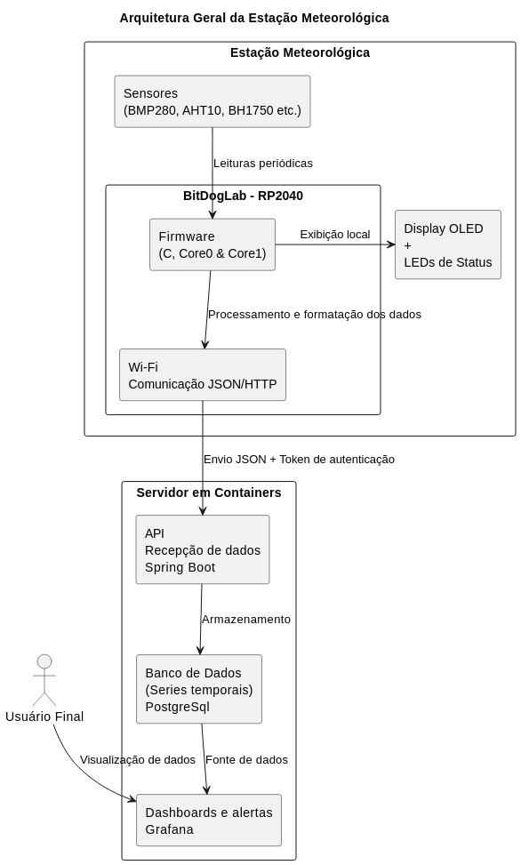

### 4.2 Segurança e Confiabilidade
Para assegurar o funcionamento contínuo e confiável do sistema em ambientes de campo, foram implementados mecanismos de segurança e tolerância a falhas em diferentes níveis da arquitetura:
- Na estação meteorológica:
  - Reconexão automática ao Wi-Fi em caso de perda de sinal.
  - Armazenamento temporário local em memória para retransmissão de dados quando a conexão é restabelecida.
  - Uso de watchdog para reinicialização automática do microcontrolador em caso de travamento.
  - Indicação visual no display OLED e LED RGB de status para facilitar diagnóstico em campo.
- Na comunicação:
  - Transmissão dos dados em formato JSON autenticado com token, evitando envio não autorizado.
  - Definição clara de contrato de dados (campos, unidades e timestamps) para evitar inconsistências.
- No servidor:
  - Estrutura em containers isolados, facilitando a manutenção e reduzindo riscos de falha sistêmica.
  - Utilização do Grafana que permite controle de acesso por usuários e perfis diferenciados.
Essas medidas garantem que a solução não apenas atenda aos requisitos funcionais, mas também opere de forma robusta e resiliente às condições de uso no campo, assegurando a disponibilidade contínua das informações para os usuários finais.

## 5. Desenvolvimento da Estação
### 5.1 Principais pontos do Hardware da estação
A estação foi composta por sensores ambientais (temperatura, umidade, pressão e luminosidade), microcontrolador RP2040 (BitDogLab), LED RGB de status, display OLED, joystick/botão de configuração e módulo de bateria. A integração modular permite fácil manutenção e substituição de componentes, enquanto os elementos de interface proporcionam feedback visual e interativo ao usuário.

**Esquemático simplificado da estação meteorológica, destacando sensores, microcontrolador, interface de usuário e fonte de alimentação.**
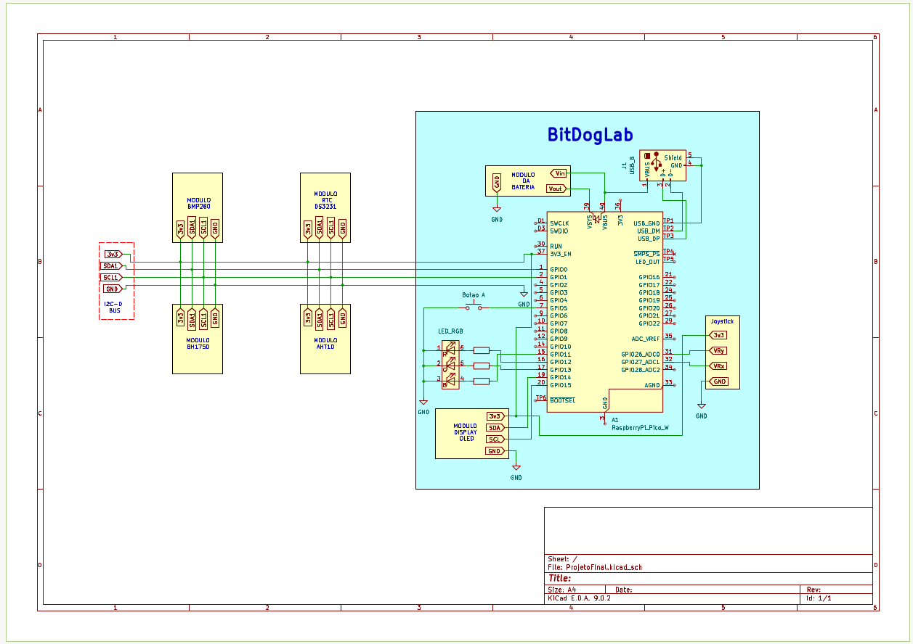

**Lista resumida de componentes**

| Componente         | Função                              | Interface |
|-------------------|--------------------------------------|-----------|
| RP2040 BitDogLab   | Processamento e controle da estação | MCU       |
| BMP280             | Temperatura e pressão               | I²C       |
| AHT10              | Umidade                             | I²C       |
| BH1750             | Luminosidade                        | I²C       |
| OLED 128x64        | Display de status e leituras        | I²C       |
| LED RGB            | Indicadores de estado               | GPIO      |
| Joystick/Botão     | Menu e configuração                 | GPIO      |
| Módulo de Bateria  | Fonte de energia                    | Alimentação |

### 5.2 Pontos relevantes do funcionamento da estação
A estação meteorológica realiza um processo de inicialização e operação contínua que garante funcionamento seguro e monitoramento efetivo:
1. Inicialização automática ao ser energizada:
   - Teste do LED RGB: cada cor do LED acende sequencialmente para verificação de funcionamento.
   - Teste do display OLED: pisca durante o boot e exibe, em seguida, o nome do software e a versão do build.
2. Modo de configuração:
   - Se o Botão A estiver pressionado durante a inicialização, o LED RGB azul acende, indicando que a estação entrou em modo configuração.
   - Esse modo também é ativado automaticamente caso a estação ainda não tenha sido configurada.
   - No modo configuração, o usuário pode ajustar parâmetros de rede, calibração de sensores e outras configurações via terminal serial USB.
3. Inicialização do Core1:
   - O LED RGB amarelo indica que o Core1 está sendo inicializado.
   Obs.: O Core1 será responsável pela aquisição de dados, armazenamento local em Flash e exibição de informações no display.
4. Operação normal:
   - Após a inicialização, a estação entra em funcionamento contínuo.
   - LED RGB indicam o estado da conexão Wi-Fi e comunicação com o servidor.
   - O display OLED apresenta os valores das últimas medições coletadas pelos sensores, atualizados em tempo real.

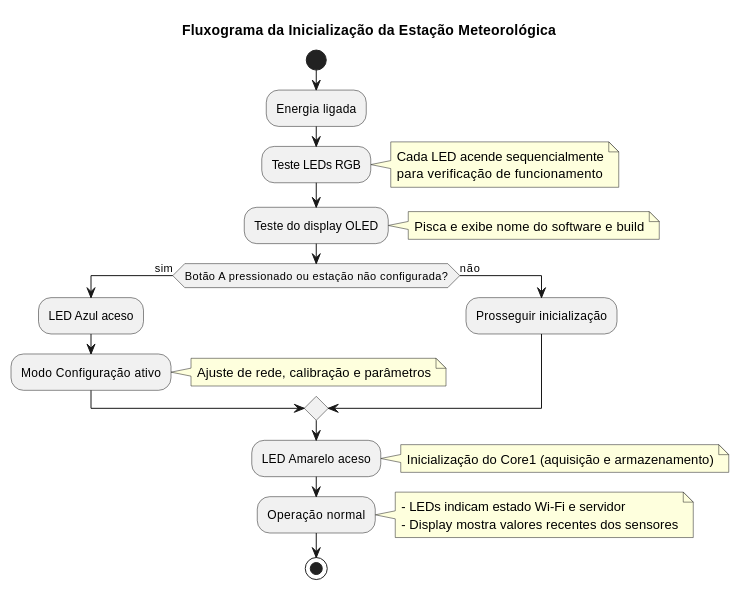

### 5.3 Principais pontos Firmware e bibliotecas utilizadas
O firmware da estação foi desenvolvido em C, utilizando o SDK oficial do Raspberry Pi Pico e a IDE VSCode. A implementação segue uma arquitetura modular, distribuída entre os dois núcleos do microcontrolador, permitindo que aquisição, armazenamento e transmissão de dados ocorram de forma paralela e eficiente.

**Bibliotecas utilizadas**
- **I²C Drivers:** suporte aos sensores: BMP280, AHT10, BH1750 e RTC DS3231 para leitura contínua de dados ambientais.
- **Display OLED:** biblioteca para controle de textos no display 128x64.
- **Wi-Fi (pico_cyw43):** módulo de conectividade para envio de dados ao servidor via rede, com reconexão automática em caso de perda de sinal.
- **Watchdog:** monitoramento de execução e proteção contra travamentos do sistema.

O firmware foi escrito em C, utilizando o SDK oficial do Raspberry Pi Pico e IDE VSCode, com bibliotecas externas para comunicação I²C, controle do display e módulo WiFi.

#### 5.3.1 Funcionamento do Core0
O **Core0** é responsável pela **inicialização do sistema, controle da comunicação Wi-Fi e envio dos dados ao servidor**, mantendo também o monitoramento contínuo do estado da estação.

**Fluxo de funcionamento:**
1. **Inicialização do sistema:**
   - Inicializa interfaces de comunicação I²C para sensores e display OLED.
   - Inicializa LED RGB, que fornecem feedback visual sobre o estado da estação.
   - Configura o display OLED, exibindo nome do software e versão do build.
1. **Verificação de modo configuração:**
   - Caso o **Botão A** esteja pressionado ou a estação não esteja configurada, o Core0 ativa o **modo configuração** via menu no display.
   - Caso necessário, ajusta também o relógio interno (RTC).
1. **Ativação do Core1:**
   - O LED RGB amarelo, nesse momento, indica que o Core1 está sendo inicializado.
   - O Core0 aguarda confirmação de que o Core1 está ativo antes de prosseguir.
1. **Gerenciamento do Wi-Fi:**
   - Inicializa o módulo Wi-Fi e mantém **conexão constante com o servidor**, com reconexão automática em caso de falha.
   - Verifica periodicamente o estado da conexão **WiFi** e atualiza o LED RGB indicativo:
     - Desconectado – LED RGB Vermelho
     - Conectado sem erros – LED RGB Verde
     - Conectado com erro – LED RGB Amarelo
1. **Sincronização de tempo e envio de dados:**
   - Solicita periodicamente a hora do servidor para sincronização do relógio interno.
   - Envia os dados coletados pelo Core1 em formato JSON para o servidor via TCP, utilizando funções de retry em caso de falha.
   - Garante que dados não enviados anteriormente sejam transmitidos antes de novos dados.
1. **Atualização do terminal e monitoramento interno:**
   - Exibe periodicamente os últimos dados coletados no terminal serial para debug.
   - Implementa watchdog (opcional) para reiniciar o sistema em caso de travamento ou falha de execução.

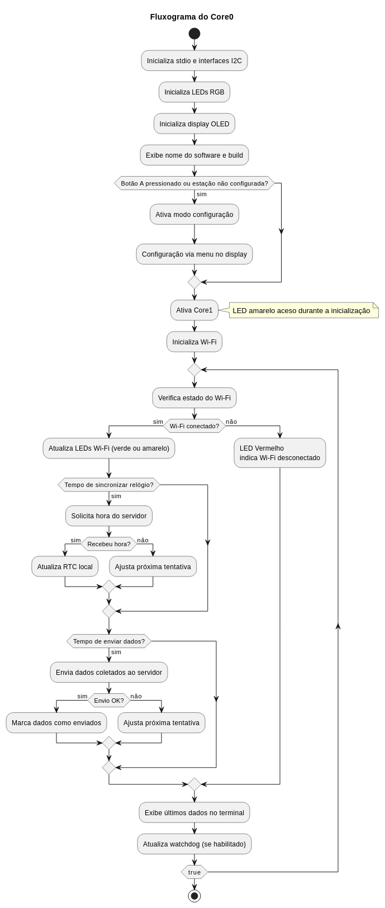

#### 5.3.2 Funcionamento do Core1
O **Core1** é responsável pela **aquisição de dados ambientais, armazenamento em memória Flash e atualização do display OLED**, além de responder às requisições do Core0.

**Fluxo de funcionamento:**

1. **Inicialização do Core1:**
   - Limpa o FIFO do multicore para evitar dados residuais.
   - Inicializa a memória Flash e lê o último ciclo de aquisição armazenado.
   - Inicializa periféricos de aquisição de sensores.
   - Limpa o display e sinaliza ao Core0 que está ativo, enviando um comando via FIFO.
1. **Loop principal:**
   - **Aquisição de dados:**
     - Realiza leituras periódicas dos sensores ambientais de acordo com o período configurado.
     - Incrementa ciclos de aquisição e, ao atingir o período de armazenamento, grava os dados na memória Flash.
   - **Atualização do display OLED:**
     - Lê o joystick para navegar entre diferentes métricas.
     - Atualiza as informações exibidas no display com os dados mais recentes.
   - **Comunicação com Core0:**
     - Recebe comandos via FIFO, incluindo:
       - **Atualização de horário** (CORE_COMM_CMD_NEW_TIME)
       - **Confirmação de envio de dados ao servidor** (CORE_COMM_CMD_SENT_DATA)
       - **Solicitação do próximo dado para envio** (CORE_COMM_CMD_GIVE_NEXT_SEND_DATA)
       - **Solicitação do último dado para exibição** (CORE_COMM_CMD_GIVE_LAST_DATA)
     - Responde aos comandos do Core0, garantindo sincronização e consistência dos dados.
1. **Armazenamento e atualização de dados:**
   - Mantém os dados recém-adquiridos salvos e disponíveis para Core0 enviar ao servidor.
   - Atualiza metadados como timestamps de envio sem sobrescrever dados originais, garantindo integridade da memória.

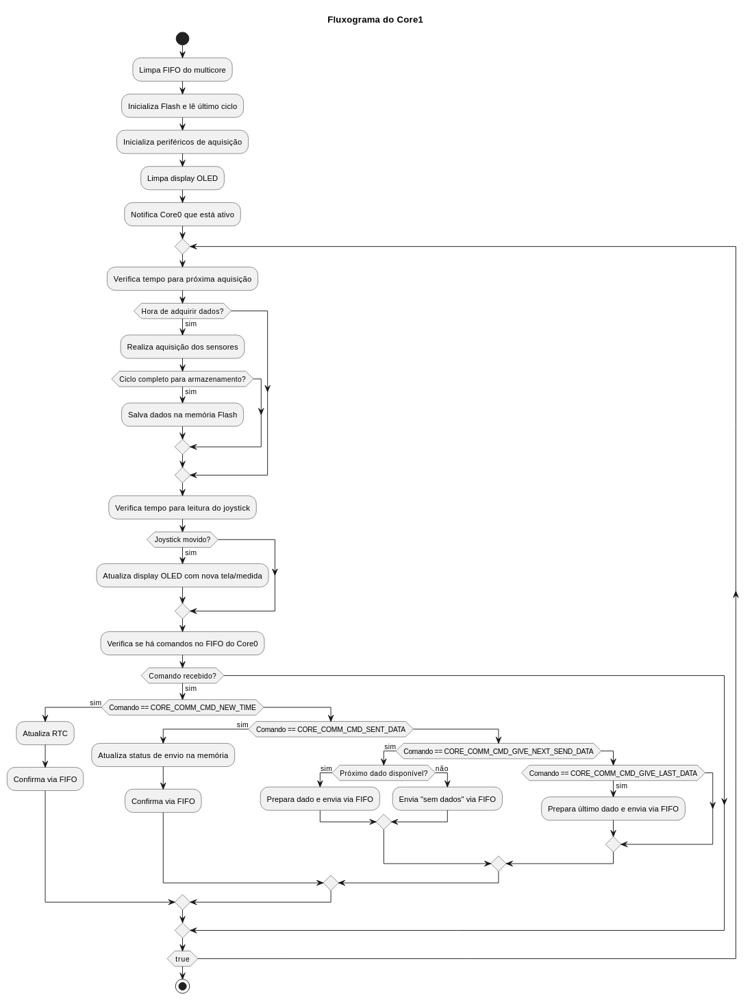

#### 5.3.3 Funcionamento da Comunicação Inter-Cores

A estação meteorológica utiliza os dois núcleos do Raspberry Pi Pico W (Core0 e Core1) de forma cooperativa, com divisão de responsabilidades. Para garantir consistência e segurança no acesso à memória Flash — recurso compartilhado e sensível — foi desenvolvido um mecanismo de comunicação inter-core baseado em FIFO (First In First Out), usando os registradores da biblioteca pico/multicore.

**Estrutura de Mensagens**

Os comandos trocados entre os núcleos estão definidos no enum CoreCommunicationCmd.

- **Comandos do Core0 → Core1:** atualização de horário (CORE_COMM_CMD_NEW_TIME), solicitação de dados (CORE_COMM_CMD_GIVE_NEXT_SEND_DATA, CORE_COMM_CMD_GIVE_LAST_DATA) e confirmação de envio (CORE_COMM_CMD_SENT_DATA).
- **Comandos do Core1 → Core0:** notificação de que um dado está pronto (CORE_COMM_CMD_DATA_READY), confirmação simples (CORE_COMM_CMD_NO_MSG_ACK) ou a requisição especial de exclusividade de Flash (CORE_COMM_CMD_HOLD).

**Comunicação iniciada pelo Core1**

A **única chamada direta feita pelo Core1 ao Core0** ocorre quando é necessário o uso da Flash.
- O Core1 envia o comando CORE_COMM_CMD_HOLD.
- No Core0, uma interrupção de FIFO é disparada e tratada pela função core0_comm_core0_fifo_irq_handler().
- O handler invoca core0_hold(), que:
  - Desabilita interrupções globais.
  - Suspende as operações em Flash, garantindo que apenas RAM seja utilizada durante o período crítico.
  - Aguarda o Core1 concluir sua operação de escrita/leitura em Flash.
  - Restaura o estado anterior e libera novamente o acesso.

Esse mecanismo garante integridade no uso da Flash, já que ela não pode ser acessada simultaneamente por ambos os núcleos.

Obs.: Quando o Core1 envia uma resposta a uma solicitação do Core0(que é diferente da CORE_COMM_CMD_HOLD) esta função é lida pela interrupção e armazenada na variavel last_core_communication_cmd sem invocar core0_hold()

**Comunicação iniciada pelo Core0**

Nas demais situações, o Core0 é o mestre da comunicação:

1. Envia um comando para o Core1 via multicore_fifo_push_blocking().
2. Fica aguardando a resposta do Core1 por meio da função core0_comm_aguarda_cmd().
3. Só após receber a confirmação (ACK ou CORE_COMM_CMD_DATA_READY), prossegue com o processamento.

Exemplos:
- Atualização de horário: Core0 envia CORE_COMM_CMD_NEW_TIME com a nova data/hora.
- Solicitação de último dado: Core0 envia CORE_COMM_CMD_GIVE_LAST_DATA e aguarda resposta.
- Solicitação de próximo dado a ser transmitido: Core0 envia CORE_COMM_CMD_GIVE_NEXT_SEND_DATA.
- Confirmação de envio ao servidor: Core0 envia CORE_COMM_CMD_SENT_DATA.

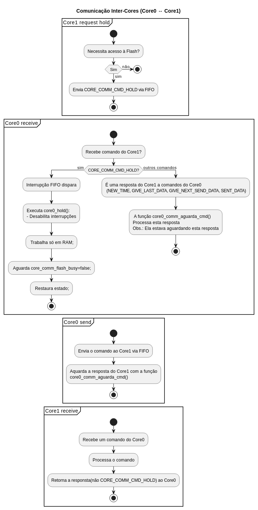

#### 5.3.4 Mecanismos de uso da Flash
O armazenamento persistente da estação é feito utilizando a **memória Flash interna do Raspberry Pi Pico W**, com uma divisão planejada para **configuração do sistema e dados de aquisição.**

**Estrutura da memória Flash**
- **Tamanho reservado:** último 1 MB da Flash.
- **Granularidade de operação:**
  - **Apagamento:** mínimo de 4 KB (um setor inteiro).
  - **Escrita:** mínimo de 256 bytes (um bloco).

**Layout**
1. **Bloco de Configuração** (primeiros 4 KB do espaço reservado):
   - Endereço base: STORAGE_OFFSET_CONF = 0x0100000.
   - Armazena parâmetros fixos de configuração do sistema.
2. **Área de Dados de Aquisição (restante):**
   - Início: STORAGE_OFFSET_DATA_FIRST = 0x0101000.
   - Tamanho de bloco: STORAGE_ADDRESS_DATA_SIZE = 256 bytes.
   - Quantidade máxima: STORAGE_ADDRESS_DATA_N_ITEMS ≈ 4080 blocos.
   - Cada aquisição é gravada em um bloco independente.

**Inicialização**

Antes de iniciar o uso, a Flash deve ser **limpa** (todos os bytes com valor 0xFF).
Isso garante que:
- As áreas ainda não utilizadas podem ser detectadas facilmente.
- O sistema inicia com uma base consistente.

**Formato de cada aquisição**

Cada bloco de aquisição tem até 256 bytes, mas os 3 primeiros uint64_t (24 bytes) são reservados para controle:

1. **Cycle ID** (buf[0]):
   - Número sequencial da aquisição.
   - Sempre crescente, mesmo após reinicializações.
   - Permite identificar a ordem cronológica das medições.
1. **Timestamp da aquisição** (buf[1]):
   - Momento em que o dado foi coletado.
1. **Timestamp do envio** (buf[2]):
   - Momento em que o dado foi transmitido com sucesso ao servidor.
   - Se contiver 0xFFFFFFFFFFFFFFFF, significa **"ainda não enviado"**.

**Política de gravação**
- **Escrita sequencial:**
  Cada nova aquisição é gravada em um bloco novo, evitando sobrescrever dados já gravados.
- **Apagamento por setor (4 KB):**
  Ao gravar o **primeiro bloco de um setor (4 KB)**, o setor inteiro é apagado.
  Isso garante que os blocos possam ser usados de forma cíclica.
- **Circularidade:**
  Quando o final da área de dados é atingido, a gravação recomeça no primeiro bloco disponível (logo após a área de configuração).   

**Gerenciamento de índices**
O código mantém variáveis de estado que permitem navegar pela memória:
- **Aquisições (aq_*):**
  - aq_index_min → índice do bloco mais antigo ainda válido.
  - aq_index_max → índice do bloco mais recente.
  - aq_cycle_min e aq_cycle_max → controlam os identificadores de aquisição.
- **Transmissões (sent_*):**
  - sent_index_max → última aquisição confirmada como enviada.
  - sent_next_index → próxima aquisição que deve ser enviada.

**Fluxo típico**
1. **Nova aquisição:**
   - O índice é obtido com storage_adm_get_next_aq_index().
   - Se for início de um setor, o setor é apagado antes de gravar.
   - O dado é gravado no bloco, preenchendo os 3 cabeçalhos + payload.
1. **Envio ao servidor:**
   - O índice do próximo dado a enviar é obtido com storage_adm_get_next_send_index().
   - Se não houver dado pendente, retorna negativo.
1. **Confirmação de envio:**
   - Após confirmação do servidor, chama-se storage_adm_was_sent().
   - O timestamp de envio é atualizado, sendo sobrescrito. Como estava com 0xFF...FF, pode ser sobrescrito.

**Resiliência**
- Como a escrita é sempre em novas posições, evita-se desgaste prematuro da Flash.
- A estratégia circular garante que a estação continue armazenando dados indefinidamente, sobrescrevendo apenas os mais antigos após o ciclo completo da memória.
- Em caso de queda de energia, na reinicialização o sistema varre a Flash (storage_adm_init()) para encontrar:
  - O último ciclo válido (aq_cycle_max).
  - O ponto de retomada de gravação.
  - Os dados ainda não enviados.
  
Esse mecanismo cria um buffer circular persistente de aquisições, com suporte a falhas e à transmissão confiável dos dados

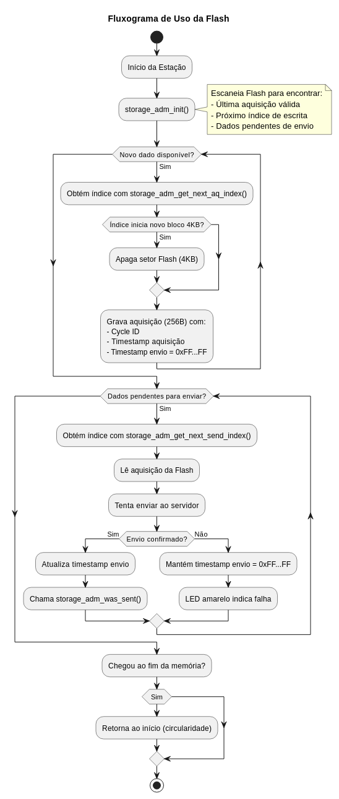

#### 5.3.5 Mecanismo de comunicação WiFi
A comunicação WiFi da estação é responsável por enviar as leituras dos sensores para o servidor, bem como sincronizar a data e hora local com o servidor. A implementação foi feita usando o módulo CYW43 do Raspberry Pi Pico W, controlado via SDK cyw43_arch.

**Inicialização**
1. **Configuração de hardware:**
   - O driver WiFi é inicializado com cyw43_arch_init().
   - É habilitado o modo estação (STA) usando cyw43_arch_enable_sta_mode().
1. **Verificação inicial:**
   - Após inicializar o hardware, a função tenta conectar ao roteador definido nas configurações (config_data.wifi_ssid e config_data.wifi_psw).
   - A função wifi_connect_or_reconnected() trata a conexão inicial e possíveis reconexões.

**Loop principal de atualização**

No loop principal do Core0 (while(true)), a função wifi_update() é chamada periodicamente:

- Se conectado (wifi_connected == true):
  - Verifica se o link WiFi ainda está ativo (cyw43_tcpip_link_status()).
  - Caso a conexão seja perdida, o estado wifi_connected é definido como false e uma pequena espera (WIFI_AFTER_CONNECT_FAIL_DELAY_MS) é aplicada antes de tentar reconectar.
- Se desconectado (wifi_connected == false):
  - Tenta reconectar chamando wifi_connect_or_reconnected().
 - Essa função:
   - Reinicializa o hardware, se necessário.
   - Tenta autenticar no roteador.
   - Verifica se um endereço IP válido foi obtido.
 - Caso a conexão falhe, o loop aguarda alguns milissegundos antes de tentar novamente.

**Envio de dados**
Com o WiFi conectado, a estação pode, quando necessário, estabelecer comunicação com o servidor para realizar os procedimentos de envio de dados ou atualização de horário.
- Caso a conexão com o servidor seja bem-sucedida, os dados ou informações do relógio podem ser processados normalmente.
- Se houver falha na comunicação com o servidor, a estação registra o problema por meio do LED RGB amarelo, indicando erro na transmissão ou sincronização.

**LED RGB de status**

O estado da conexão WiFi é refletido no LED RGB da estação:
- **Desconectado:** LED RGB vermelho.
- **Conectado sem erro:** LED RGB verde.
- **Conectado com erro:** LED RGB amarelo.

Isso permite monitoramento visual do estado da rede sem necessidade de consultar logs.

**Resiliência e reconexão automática**
- O módulo WiFi é capaz de **reconectar automaticamente** em caso de falha.
- Pequenas pausas são aplicadas entre tentativas para evitar loops de conexão muito rápidos.

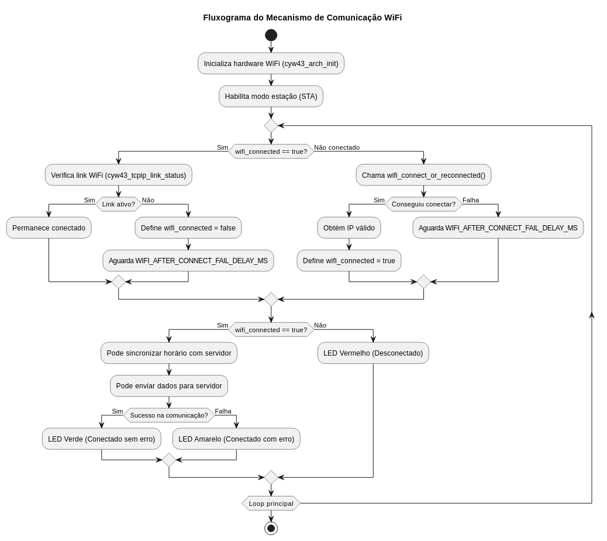

### 5.4 Consumo
O consumo de corrente da estação foi medido em diferentes estados de operação, de forma a caracterizar o impacto do módulo WiFi e do processo de transmissão nos requisitos energéticos do sistema.

- **WiFi desconectado:** ~46 mA
(condição básica de funcionamento, apenas com o microcontrolador e periféricos ativos).
- **WiFi conectado:** ~70 mA
(estado ocioso, porém com o módulo WiFi ativo e sincronizado à rede).
- **Transmitindo dados:** ~97 mA
(pico típico durante o envio de pacotes JSON ao servidor via TCP).

Essas medidas indicam que a maior variação de consumo ocorre na fase de transmissão, enquanto o estado de idle conectado apresenta consumo intermediário.

**Observação:** O consumo pode variar em função do número de sensores ativos, intensidade do sinal WiFi, frequência de amostragem e temperatura ambiente.

## 6. Servidor e Armazenamento de Dados
O servidor foi projetado para receber, armazenar e disponibilizar os dados provenientes da estação meteorológica, servindo de base para a camada de visualização no Grafana. A arquitetura foi implementada em containers Docker, garantindo modularidade, escalabilidade e facilidade de replicação.

### 6.1 Criação de “dummys” para simulação da estação
Com o objetivo de validar o servidor antes da integração com a estação física, foram desenvolvidos três programas em Java localizados no diretório Simuladores:

- [IoT_Dummy_SendData.java](Simuladores/IoT_Dummy_SendData.java) – simula uma estação enviando leituras aleatórias em tempo real. Permitiu validar a recepção, o armazenamento e a visualização dos dados.
- [IoT_Dummy_GetTime.java](Simuladores/IoT_Dummy_GetTime.java) – solicita a data e hora atuais ao servidor, garantindo o correto funcionamento do serviço de sincronização.
- [IoT_Dummy_SendOldData.java](Simuladores/IoT_Dummy_SendOldData.java) – gera e envia dados aleatórios referentes a vários dias passados (últimos 8 dias, para múltiplas estações), possibilitando popular o banco de dados com grande volume de registros para testes de carga.

Esses simuladores foram fundamentais para o desenvolvimento incremental, permitindo avaliar o comportamento do sistema em cenários distintos sem depender da estação física.

### 6.2 Desenvolvimento do servidor
O servidor foi estruturado a partir de um arquivo docker-compose.yml, responsável por orquestrar três containers principais:
- API (Spring Boot) – responsável por receber os dados enviados pela estação e disponibilizar a data/hora atual sob demanda.
- Banco de Dados (PostgreSQL) – responsável pelo armazenamento persistente das séries temporais.
- Grafana – interface de visualização dos dados armazenados.

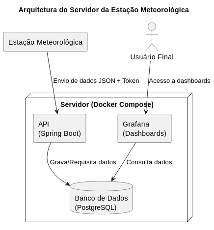

Foram criadas duas versões do ambiente:
1. Servidor/ServidorComDashboard – inclui uma configuração inicial do Grafana com datasource pré-configurado e dashboards básicos.
1. Servidor/ServidorSemDashboard – versão mínima, onde o datasource e os dashboards precisam ser configurados manualmente.

Essa abordagem flexível facilita tanto o uso em ambiente de testes quanto a replicação em novas instalações.

### 6.3 Segurança e tolerância a falhas

Para aumentar a confiabilidade do servidor, foram consideradas medidas de segurança e resiliência:
- Isolamento em containers – reduz o impacto de falhas de um componente sobre os demais.
- Controle de acesso – O Grafana permite configurar autenticação e definição de tipo de usuário.
- Persistência de dados – uso de volumes Docker para manter os dados mesmo após reinicialização dos containers.

### 6.4 Testes com o servidor
Os testes ocorreram em duas etapas:
1. Com programas dummy – utilizando os simuladores em Java na mesma máquina do servidor, permitindo validar rapidamente recepção, armazenamento e visualização de dados, sem problemas de conectividade.
1. Com a estação física – após validação inicial, a estação meteorológica foi conectada ao servidor real, possibilitando verificar comunicação via Wi-Fi, envio periódico de dados e atualização em tempo real nos dashboards do Grafana.

Esses testes confirmaram a robustez da arquitetura e sua adequação tanto para cenários de prototipagem quanto para uso em campo.

## 7. Visualização e Monitoramento com Grafana
A etapa de visualização dos dados foi fundamental para transformar as leituras captadas pela estação em informações compreensíveis e úteis. Para isso, optou-se pelo Grafana, uma plataforma open source amplamente utilizada em projetos de monitoramento. Sua flexibilidade na integração com diferentes bancos de dados e a ampla gama de opções de visualização foram determinantes para a escolha.

### 7.1 Configuração inicial
Após a instalação do Grafana no servidor, foi realizada a configuração do datasource, conectando-o ao banco de dados onde as medições eram armazenadas.
Além disso, definiu-se o intervalo de atualização automática, de forma que os dados fossem exibidos em tempo real, sem necessidade de recarga manual das páginas.
O Grafana ainda permite que se crie perfis de usuário com níveis distintos (administrador, operador e visitante), garantindo segurança e controle de acesso aos dashboards

### 7.2 Painéis desenvolvidos

Foram criados dois dashboards principais, cada um com foco em diferentes conjuntos de variáveis:

#### Dashboard 1
- Mapa mostrando a localização da estação.
- 3 gauges de monitoramento: temperatura, pressão e umidade.
- Gráfico exibindo máximos e mínimos diários das três grandezas.
- Painéis complementares: um mostrando máximo e mínimo da temperatura do dia, e outro com média das temperaturas máximas e mínimas da semana.
  
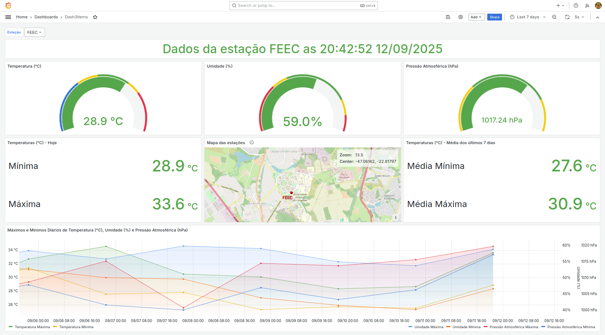

#### Dashboard 2
- Mapa da estação.
- 4 gauges de monitoramento: temperatura, pressão, umidade e luminosidade.

Ambos os dashboards possuem filtros para seleção da estação a ser consultada e podem ser complementados com painéis adicionais para análise de variáveis específicas.

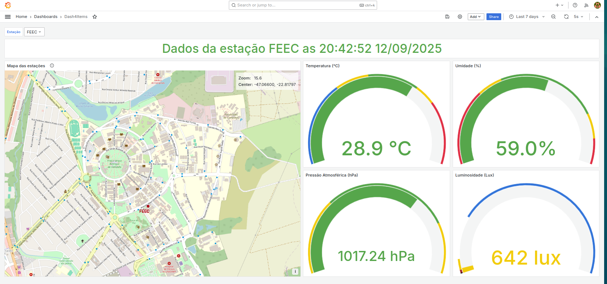

### 7.3 Interpretação dos dados
O acompanhamento em tempo real permite a detecção imediata de mudanças bruscas, como aumento repentino da velocidade do vento, alteração da direção do vento ou queda de temperatura. Os gráficos históricos possibilitam identificar padrões, ciclos diários e variações sazonais.

## 8. Resultados Obtidos
O desenvolvimento e a integração da estação meteorológica foram acompanhados de testes que permitiram avaliar seu funcionamento, a confiabilidade das medições e o desempenho geral do sistema.

### 8.1 Testes funcionais
A estação foi submetida a diferentes condições ambientais, simulando variações de temperatura, umidade, luminosidade e pressão. Durante esses testes, verificou-se:
- Funcionamento correto de todos os sensores conectados via I²C;
- Inicialização adequada do firmware, com Core0 e Core1 executando suas funções específicas;
- Comunicação estável com o servidor via Wi-Fi;
- Atualização em tempo real dos dashboards no Grafana.

Esses resultados confirmam que a estação atende aos requisitos funcionais definidos no planejamento do projeto.

### 8.2 Confiabilidade das medições
As leituras obtidas apresentaram coerência interna e consistência com os valores esperados de acordo com dados climáticos típicos da região. Devido à indisponibilidade de equipamentos de referência calibrados durante os testes, não foi possível realizar uma validação quantitativa absoluta. No entanto, os resultados indicam que a estação fornece informações confiáveis para monitoramento contínuo e análise de tendências.

### 8.3 Desempenho do sistema
O sistema demonstrou tempo de resposta adequado desde a aquisição dos sensores até a visualização no Grafana. A transmissão de dados via Wi-Fi apresentou estabilidade em períodos contínuos de operação, sem perda significativa de pacotes. O uso do Core1 para aquisição e armazenamento local, aliado ao Core0 para transmissão, garantiu processamento eficiente sem sobrecarga do microcontrolador.

## 9. Conclusão
O projeto atingiu os objetivos propostos, entregando uma estação meteorológica IoT funcional, modular e conectada, capaz de medir variáveis ambientais e disponibilizar os dados em tempo real por meio de dashboards interativos no Grafana.

A solução desenvolvida demonstrou robustez e confiabilidade, com sensores funcionando corretamente, transmissão de dados estável via Wi-Fi e armazenamento seguro em servidor com possibilidade de expansão. O uso do firmware distribuído entre os dois núcleos do RP2040 permitiu separar de forma eficiente as funções de aquisição e armazenamento (Core1) das funções de inicialização e transmissão de dados (Core0), garantindo desempenho adequado mesmo em operação contínua.

Os dashboards criados no Grafana tornaram as informações acessíveis e interpretáveis, permitindo monitoramento em tempo real, análise de tendências históricas e configuração de alertas automáticos para variáveis críticas. Essa capacidade transforma dados brutos em informações acionáveis, úteis para tomada de decisão na agricultura familiar e no agronegócio.

Além disso, o projeto possibilitou o desenvolvimento de documentação técnica completa, simuladores de teste (dummys) e um ambiente de servidor flexível, fornecendo uma base sólida para trabalhos futuros, manutenção e escalabilidade do sistema.

Em síntese, a estação meteorológica desenvolvida cumpre sua função de fornecer dados ambientais confiáveis e acessíveis, com impacto direto na educação, monitoramento e gestão agrícola, demonstrando a viabilidade de soluções IoT de baixo custo aplicadas ao campo.

### Visão Externa
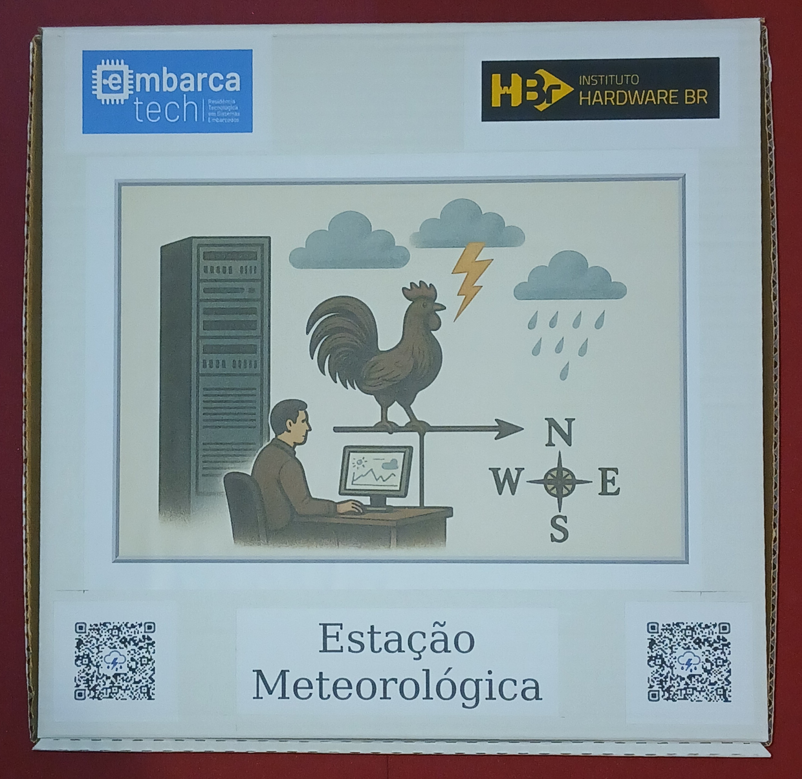

---

### Visão Interna 1
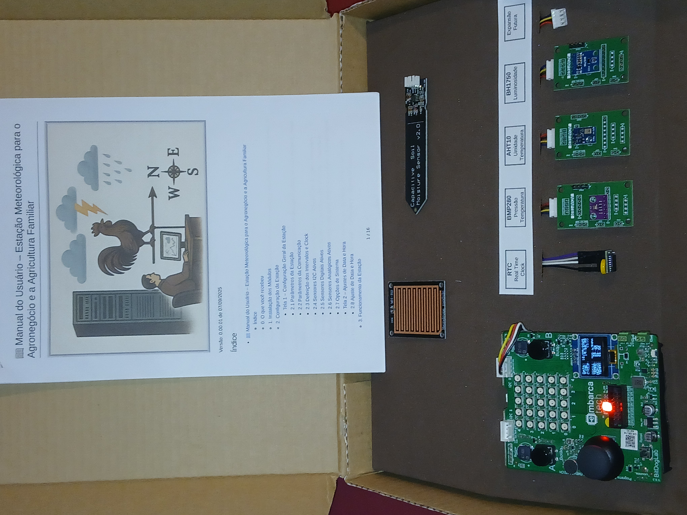

---

### Visão Interna 2
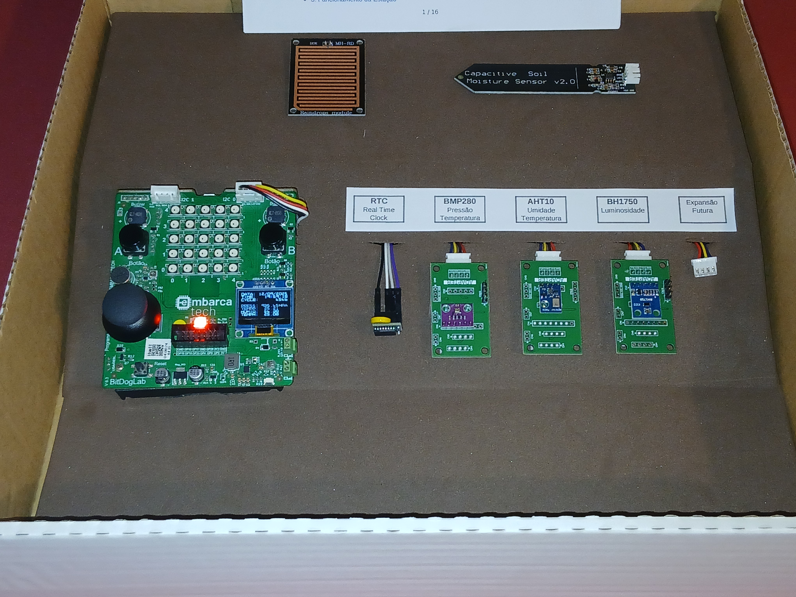

---

### QRCode da Etapa

## 10. Especificações Técnicas
- **Placa base:** BitDogLab (RP2040 com Wi-Fi)  
- **Sensores:** digitais I²C para parâmetros ambientais  
- **Comunicação:** Wi-Fi 2.4 GHz  
- **Display:** OLED SSD1306 128x64 px  
- **Servidor:** Linux + Banco de dados relacional + Grafana  

### 11. Principais características

### 11.1 Principais características da estação
  
- **Placa mãe:** BitDogLab V6.3.
- **Software Build:** 0015 ou superior.
- **Consumo médio típico:**
	+ WiFi desconectado: 46 mA
	+ WiFi conectado: 70 mA
	+ Transmitindo dados: 97 mA  

  Obs.: Sem sensores AD de alto consumo.

- **Duração estimada da bateria backup** (presente na BitDogLab): ~20 horas
	+ Para Bateria 18650 de 2000 mAh  

- **Modo de comunicação:**
	+ WiFi Conexão constante com o roteador, com reconexão automática.
- **Vida estimada da memória Flash:**
  -  **> 12 anos** Supondo uma aquisição salva por segundo.
  -  **> 120 anos** Supondo uma aquisição salva a cada 10 segundos.
  
  Ref.: minimo 100K escritas por setor(W25Q16JV).
- **Mecanismo de Integridade:**
	+ WatchDog com timeout de 45 segundos.

### 11.2 Principais características dos sensores homologados

| Sensor | Grandeza | Unidade | Range | Precisão | Faixa de Operação |Consumo | Outros |
| --- | --- | --- | --- | --- | --- | --- | --- |
| BMP280 | Pressão | hPa| 300-1100hPa|+-1hPa (de 0 a +40C) | -40 - +85 C | 1120 uA peak | I2C ad=0x76 |
| BMP280 | Temperatura | Celsius | 0 - 65 C| +-1.0 C | |
| AHT10 | Umidade | Relativa | 0 - 100% | +-3% | -40 - 100C| 23 ua | I2C ad=0x38 |
| AHT10 | Temperatura | Celsius | -40 - 80C | +- 0,4 C |
| BH1750 | Luminosidade | lx|0-65535 * | 1.2x  | -40 - +85C | 190 uA | I2C ad=0x23 0x5C |

### 11.3 Principais características dos sensores em homologação
Obs.1: Para sua inclusão na estação pode ser necessitar de atualização de firmware e/ou hardware
Obs.2: Como os sensores estão em homologação a tabela abaixo é apenas um indicativo, com valores ausentes em virtude da homologação.

| Sensor | Grandeza | Unidade | Range | Precisão | Faixa de Operação |Consumo | Outros |
| --- | --- | --- | --- | --- | --- | --- | --- |
| HMC5883 | Direção do Vento |Graus| 0-359 graus| 1 grau |-30 - +85C | 100 uA| I2C ad=0x1E |
| --- | --- | --- | --- | --- | --- |
|  | Quantidade de chuva | mm  | --- | --- | --- | --- |
|  | Velocidade do Vento | m/s | --- | --- | --- | --- |
| --- | --- | --- | --- | --- | --- |
| | Índice UV | índice | 0 - 12 | --- | --- | --- | Portas AD de 0 a 8 |
| | Umidade do Solo | % | --- | --- | --- | --- | Portas AD de 0 a 8 |
| | Temperatura do Solo | Celsius | --- | --- | --- | --- | Portas AD de 0 a 8 |
| | Concentração de CO | ppm | --- | --- | --- | --- | Portas AD de 0 a 8 |
| | Concentração de CO2 | ppm | --- | --- | --- | --- | Portas AD de 0 a 8 |
| | Concentração de O3 | ppm | --- | --- | --- | --- | Portas AD de 0 a 8 |

### 12. Especificação do servidor
- **Suporte a containers Docker:** arquitetura 64 bits
- **Configuração de rede:** IP fixo
- **Porta de acesso externo:** 8080 liberada
- **Memória RAM disponível:** 1 GB para a aplicação
- **Espaço em disco:** 16 GB para a aplicação

**Observação:** os requisitos podem ser maiores dependendo do número de estações conectadas, da taxa de aquisição de dados e do número de dashboards ativo

## 13. Trabalhos Futuros
Como evolução do projeto, sugerem-se as seguintes melhorias e expansões:
1. **Novos sensores e aquisições:**
   - Inclusão de sensores adicionais (AD externo, SDCard para armazenamento).
   - Suporte a diferentes tipos de variáveis ambientais, como radiação UV ou qualidade do ar.
2. **Hardware e otimização da placa:**
   - Desenvolvimento de uma PCI específica com foco em:
   - Compactação do hardware
   - Redução de custos
   - Maior configurabilidade e modularidade
   - Suporte a energia solar para operação autônoma em campo
3. **Comunicação e segurança:**
   - Implementação de protocolo HTTPS para comunicação segura.
   - Introdução de mecanismo de token no servidor para autenticação.
   - Comunicação via LoRa para cobrir longas distâncias.
4. **Alertas e monitoramento:**
   - Implementação de alertas automáticos por diferentes canais (e-mail, WhatsApp, push notifications).
   - Configuração de thresholds dinâmicos e personalizados para diferentes variáveis ambientais.

## 14. Referências
- [Documentação oficial do Raspberry Pi Pico SDK](https://www.raspberrypi.com/documentation/microcontrollers/c_sdk.html)
- [Manuais de sensor BMP280](https://www.bosch-sensortec.com/media/boschsensortec/downloads/datasheets/bst-bmp280-ds001.pdf)
- [Manuais de sensor AHT10](https://docs.cirkitdesigner.com/component/7c80d1fe-9bb1-4f67-a8d1-175755e4c4ce/aht10)
- [Manuais de sensor BH1750](https://components101.com/sensors/bh1750-ambient-light-sensor)
- [Grafana Labs – Documentação oficial](https://grafana.com/docs/grafana/latest/dashboards/)
- [Tutoriais de integração IoT e bases de dados](https://edgeglobal.com.br/blog/4-passos-para-integrar-dados-com-solucoes-iot/)
- [Desenvolvimento IoT](https://embarcados.com.br/desenvolvimento-de-um-ambiente-iot-completo-do-microcontrolador-ao-grafana/)