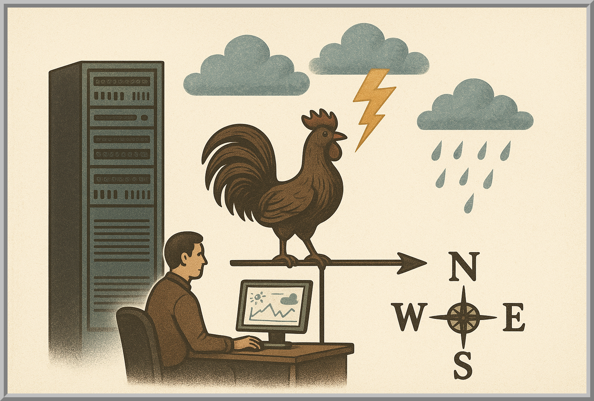
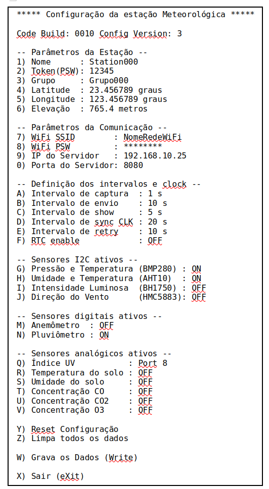
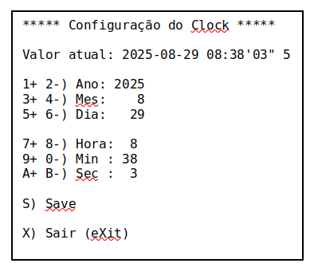
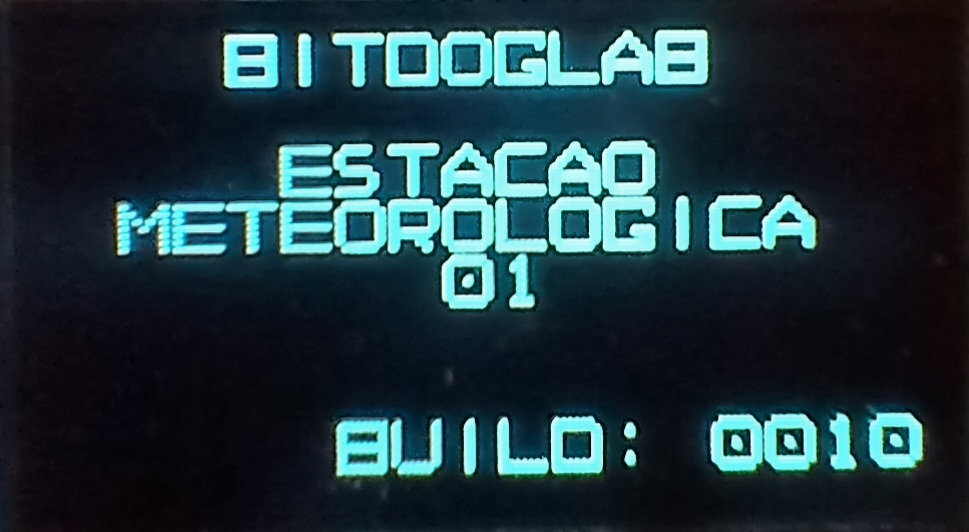
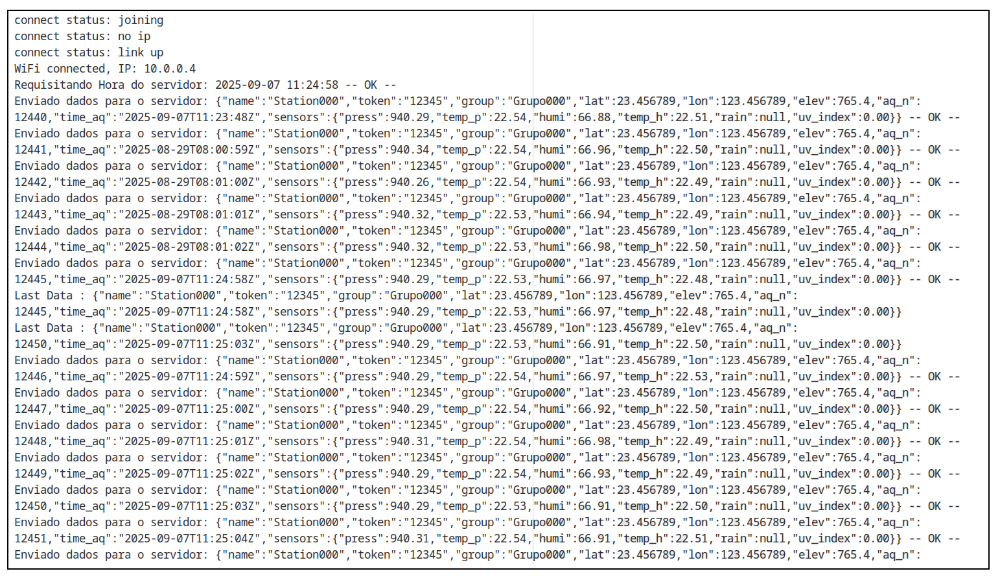
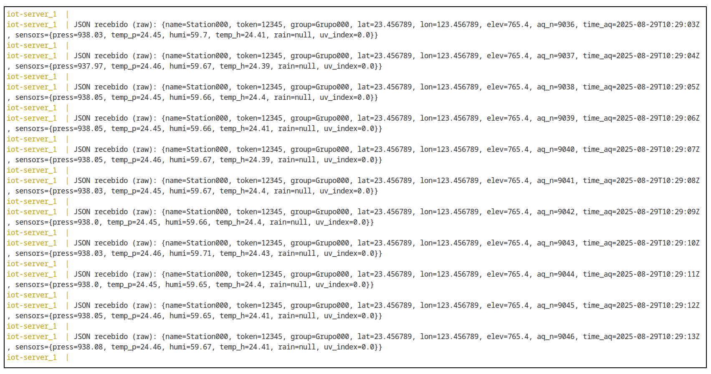
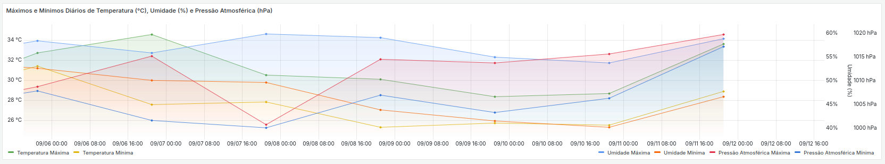

# 📖 Manual do Usuário – Estação Meteorológica para o Agronegócio e a Agricultura Familiar

Autores: **Carlos Martinez Perez** e **Ricardo Jorge Furlan**

Versão: 0.00.02 de 12/09/2025

## Índice

- [📖 Manual do Usuário – Estação Meteorológica para o Agronegócio e a Agricultura Familiar](#-manual-do-usuário--estação-meteorológica-para-o-agronegócio-e-a-agricultura-familiar)
  - [Índice](#índice)
  - [0. O que você recebeu](#0-o-que-você-recebeu)
  - [1. Instalação dos Módulos](#1-instalação-dos-módulos)
  - [2. Configuração da Estação](#2-configuração-da-estação)
    - [Tela 1 – Configuração Geral da Estação](#tela-1--configuração-geral-da-estação)
    - [2.1 Parâmetros da Estação](#21-parâmetros-da-estação)
    - [2.2 Parâmetros da Comunicação](#22-parâmetros-da-comunicação)
    - [2.3 Definição dos Intervalos e Clock](#23-definição-dos-intervalos-e-clock)
    - [2.4 Sensores I2C Ativos](#24-sensores-i2c-ativos)
    - [2.5 Sensores Digitais Ativos](#25-sensores-digitais-ativos)
    - [2.6 Sensores Analógicos Ativos](#26-sensores-analógicos-ativos)
    - [2.7 Opções de Sistema](#27-opções-de-sistema)
    - [Tela 2 – Ajustes de Data e Hora](#tela-2--ajustes-de-data-e-hora)
    - [2.8 Ajuste de Data e Hora](#28-ajuste-de-data-e-hora)
  - [3. Funcionamento da Estação](#3-funcionamento-da-estação)
    - [3.1 Indicações do LED RGB](#31-indicações-do-led-rgb)
    - [3.2 Indicações do Display da Placa Mãe](#32-indicações-do-display-da-placa-mãe)
    - [3.3 Indicações do Monitor Serial](#33-indicações-do-monitor-serial)
  - [4. Instalação do Servidor](#4-instalação-do-servidor)
  - [5. Uso do Grafana](#5-uso-do-grafana)
    - [5.1 Painéis do Dashboard](#51-painéis-do-dashboard)
      - [Escolha da estação](#escolha-da-estação)
      - [Indicadores em tempo real (Gauges)](#indicadores-em-tempo-real-gauges)
      - [Temperaturas mínimas e máximas do dia](#temperaturas-mínimas-e-máximas-do-dia)
      - [Médias semanais](#médias-semanais)
      - [Mapa das estações](#mapa-das-estações)
      - [Gráfico de históricos](#gráfico-de-históricos)
    - [5.2 Como Acessar o Dashboard](#52-como-acessar-o-dashboard)
  - [6. Especificações Técnicas da Estação](#6-especificações-técnicas-da-estação)
    - [Principais características](#principais-características)
    - [Características dos sensores homologados](#características-dos-sensores-homologados)
    - [Características dos sensores em homologação](#características-dos-sensores-em-homologação)
    - [Especificação do servidor](#especificação-do-servidor)

---

## 0. O que você recebeu
- Uma caixa suporte para os principais sensores;
- Uma placa BitDogLag;
- Sensores:
  - BMP280, sensor de pressão e temperatura;
  - AHT10, sensor de umidade e temperatura;
  - BH1759, sensor de luminosidade;
- RTC DS3131;
- Placa Expansora I2C;
- 4 Cabos JST XH de 4 pinos;
- 1 Cabo JST XH de 4 pinos para RTC;
- Cabo USB;
- Manual de instruções.

---

## 1. Instalação dos Módulos

Para colocar a estação meteorológica para o Agronegócio e a Agricultura Familiar em funcionamento, instale os módulos segundo os seguintes passos:
   - Conecte os módulos I2C na placa expansora I2C com os cabos JST XH de 4 pinos fornecidos;
   - Conecte a placa expansora o RTC com o cabo JST XH de 4 pinos para RTC;
   Obs.: **Cuidado** ao conectar na placa expansora pois ela possui um conector que é exclusivo para fazer a conexão com a BitDogLab;
   - Conecte a placa expansora com o cabo JST XH de 4 pinos, ao conector I2C-0 da BitDogLab;
   - Para os módulos que não são I2C siga as instruções contidas nos respectivos manuais;
   - Conecte A BitDogLab a uma fonte USB de 5 Volts para o funcionamento normal.
   Obs.: é Fornecido separadamente vários modelos de fontes de 5 Volts USB, cada uma com um tipo de fonte energética como:Energia solar, eólica, rede elétrica etc, consulte;
   - Obs.: Para a configuração inicial da estação será necessário conectar a BitDogLab em um terminal serial USB.

---

## 2. Configuração da Estação

- A estação meteorológica inicia automaticamente seu funcionamento assim que for energizada.
- Case se deseje ajustar os parâmetros da estação, configuração, que será feito via terminal serial USB, basta pressionar o botão A da BitDogLab antes de energizá-la, e mantenha pressionado até o LED azul ficar aceso após o display acender, ai pode soltá-lo e conectar o terminal serial
- A configuração é realizada através de **menus textuais** exibidos no monitor serial.
  - O primeiro menu permite ajustar parâmetros gerais, de comunicação, os intervalos de operação e ativar e desativar os sensores disponíveis, conforme será descrito a seguir.
  - O segundo menu permite que se ajuste o Relógio, Obs.: caso não se utiliza RTC sempre ao energizar a estação se entrará no menu de ajuste do relógio.

### Tela 1 – Configuração Geral da Estação

A imagem abaixo mostra a tela de configuração geral da estação:

  

---

### 2.1 Parâmetros da Estação

Escolha o número do menu, atualize com o valor desejado e pressione Enter para alterar.

- **Nome** – Identificação da estação na rede.
- **Token (PSW)** – Senha utilizada para autenticação junto ao servidor.
- **Grupo** – Permite organizar várias estações sob um mesmo identificador.
- **Latitude / Longitude / Elevação** – Definem a posição geográfica da estação.

---

### 2.2 Parâmetros da Comunicação

Escolha o número do menu, atualize com o valor desejado e pressione Enter para alterar.

- **WiFi SSID** – Nome da rede Wi-Fi que será utilizada.
- **WiFi PSW** – Senha da rede Wi-Fi.
- **IP do Servidor** – Endereço IP do servidor central.
- **Porta do Servidor** – Porta TCP usada para envio dos dados.

---

### 2.3 Definição dos Intervalos e Clock

Pressione a letra do menu para escolher os valores desejados.

- **A) Intervalo de captura** – Tempo entre cada registro da leitura dos sensores. Escolha um dos intervalos pré definidos: 1 s, 2 s, 5 s, 10 s, 20 s, 1 min, 2 min, 5 min, 10 min, 20 min ou 1 hora.
- **B) Intervalo de envio** – Tempo entre transmissões de dados para o servidor. Escolha um dos intervalos pré definidos: 10 s, 20 s, 1 min, 2 min, 5 min, 10 min, 20 min, 1 hora, 2 horas, 6 horas, 12 horas, 1 dia ou Desativado.
- **C) Intervalo de show** – Frequência de envio das informações para o terminal serial. Escolha um dos intervalos pré definidos: 1 s, 2 s, 5 s, 10 s, 20 s, 1 min, 2 min, 5 min, 10 min, 20 min, 1 hora, 2 horas, 6 horas, 12 horas, 1 dia ou Desativado.
- **D) Intervalo de sync CLK** – Período para sincronização do relógio. Escolha um dos intervalos pré definidos: 1 s, 2 s, 5 s, 10 s, 20 s, 1 min, 2 min, 5 min, 10 min, 20 min, 1 hora, 2 horas, 6 horas, 12 horas, 1 dia ou Desativado.
- **E) Intervalo de retry** – Tempo de espera entre tentativas de reconexão com o servidor. Escolha um dos intervalos pré definidos: 1 s, 2 s, 5 s, 10 s, 20 s, 1 min, 2 min, 5 min, 10 min, 20 min, 1 hora, 2 horas, 6 horas, 12 horas ou 1 dia.
- **F) CLK enable** – Ativa ou desativa o uso do módulo RTC (Real Time Clock).

---

### 2.4 Sensores I2C Ativos

Pressione a letra correspondente para ativar ou desativar os sensores I2C.

- **G) Pressão e Temperatura (BMP280)** – Mede pressão atmosférica e temperatura.
- **H) Umidade e Temperatura (AHT10)** – Mede umidade relativa do ar e temperatura.
- **I) Intensidade Luminosa (BH1750)** – Mede luminosidade ambiente.
- **J) Direção do Vento (HMCS5883)** – Magnetômetro que indica direção do vento.

---

### 2.5 Sensores Digitais Ativos

Pressione a letra correspondente para ativar ou desativar os sensores digitais.

- **M) Anemômetro** – Mede a velocidade do vento.
- **N) Pluviômetro** – Mede volume de chuva acumulado.

---

### 2.6 Sensores Analógicos Ativos

Pressione a letra correspondente do sensor para escolher a porta analógica em que ele está conectado. A porta 0 é a entrada analógica da BitDogLab. As portas de 1 a 8 são da placa de conversão analógico/digital AD5592 (item opcional).

- **O) Índice UV** – Mede intensidade de radiação ultravioleta.
- **P) Temperatura do solo** – Mede a temperatura do solo.
- **S) Umidade do solo** – Mede a umidade do solo.
- **T) Concentração CO** – Mede concentração de monóxido de carbono.
- **U) Concentração CO₂** – Mede concentração de dióxido de carbono.
- **V) Concentração O₃** – Mede concentração de ozônio.

---

### 2.7 Opções de Sistema

Pressione a letra correspondente para realizar a operação desejada.

- **Y) Reset Configuração** – Restaura os parâmetros de fábrica na tela.
- **Z) Limpa todos os dados** – Apaga todos os registros locais, **é necessário ser executado na primeira inicialização da estação**.
- **W) Grava os Dados (Write)** – Salva as alterações de configuração realizadas.
- **X) Sair (Exit)** – Encerra o menu de configuração.

---

### Tela 2 – Ajustes de Data e Hora

A imagem abaixo mostra a tela de ajuste de Data e Hora:

### 2.8 Ajuste de Data e Hora

Pressione os números ou letras correspondentes para incrementar ou decrementar as variáveis de data e hora e para salvar ou sair.

- **1+ / 2-** – Incrementa ou decrementa o ano.
- **3+ / 4-** – Incrementa ou decrementa o mês.
- **5+ / 6-** – Incrementa ou decrementa o dia.
- **7+ / 8-** – Incrementa ou decrementa a hora.
- **9+ / 0-** – Incrementa ou decrementa os minutos.
- **A+ / B-** – Incrementa ou decrementa os segundos.
- **S) Save** – Grava as alterações feitas.
- **X) Sair (Exit)** – Vai para a coleta de dados meteorológicos.

Ao sair com a tecla X, é mostrada a mensagem **** Fim da Configuração do Clock **** e a estação entra em operação.

---

## 3. Funcionamento da Estação

Após a energização do sistema o LED RGB pisca rapidamente em sequências as cores vermelho, verde e azul, na sequência o Display pisca e mostra a mensagem:

Se o botão A for pressionado quando o display ainda está piscando e continuar assim até o LED azul ficar acesso, a estação ativa o modo de configuração, conforme já mencionado acima. Após a configuração e/ajuste do relógio a operação da estação meteorológica começa. 

### 3.1 Indicações do LED RGB

Durante a operação, a cor do LED indica:
- Vermelho ==> Não há conexão com o roteado;
- Verde ==> Conexão WiFi estabelecida com o roteador, roteador, e não houve falhas de acesso ao servidor;
- Amarelo ==> Conexão WiFi estabelecida com o roteador, mas a última tentativa de conexão com o servidor falhou
- Piscadas Azuis ==> Dados da estação estão sendo salvos na memória não volátil

---

### 3.2 Indicações do Display da Placa Mãe

Durante o funcionamento o display é atualizado a cada nova aquisição de dados. As 3 primeiras linhas do display são fixas e indicam:
- "DATA" - A data atual (UTC)
- "TIME" - A hora atual (UTC)
- "CYCLE" - número de aquisições feitas desde quando os dados foram limpos da memória

As 4 últimas linhas trazem informações da estação e das leituras efetuadas e com o joystick é possivel navegar entre elas:
- Build : Build do software;
- linha em branco;
- nome_da_estação;
- token;
- grupo;
- lat : latitude;
- lon : longitude;
- elev: elevação;
- Press: Pressão atmosférica;
- Tempp: Temperatura reportada pelo sensor BMP280;
- Humid: Umidade relativa do ar;
- Temph: Temperatura reportada pelo sensor AHT10;
- Lumin: Luminosidade;
- WindD: Direção do vento;
- WindS: Velocidade do vento;
- Rain : Intensidade da precipitação;
- CO   : Concentração de CO;
- CO2  : Concentração de CO2;
- O3   : Concentração de O3;
- SoilH: Umidade relativa do solo;
- SoilT: Temperatura do solo;
- Uv In: Índice UV.

---

### 3.3 Indicações do Monitor Serial

Durante a operação da estação, o monitor serial mostra:
- Aquisições efetuadas periodicamente
- Dados enviados para o servidor, bem como o resultado do envio.
- Requisições de atualização do relógio, bem como o resultado da requisição.

---

## 4. Instalação do Servidor

Para que os dados da estação possam ser armazenados remotamente e acessos pela internet é necessário instalar o servidor.
Esta versão básica de servidor é de simples instalação e inclui todos os componentes necessários e roda em contêiner.
Para instalar e levantar o servidor faça:
- download dos arquivos do servidor em https://github.com/EmbarcaTech-2025/projeto-final-carlos_ricardo/tree/main/Etapa4/Servidor em um diretório *servidor*
- no terminal entre no diretório *servidor*
- rode:
  - $ docker-compose build
- e depois rode:
  - $ docker-compose up 
  
Isso colocará no ar três contêiner docker com as funcionalidades necessárias:
- API
- Banco de dados
- Grafana
  Obs.: É possível acompanhar a chegada das requisições da estação monitorando o terminal a onde foi executado o comando:
  - $ docker-compose up
  Exemplo abaixo:
  

---

## 5. Uso do Grafana

O projeto da estação meteorológica utiliza o Grafana como plataforma open source para monitoramento e visualização de dados em tempo real. O dashboard criado para a visualização aparece abaixo.  
Exemplo 1:

Exemplo 2:

### 5.1 Painéis do Dashboard

**Descrição do exemplo1**

#### Escolha da estação
Selecione a estação que deseja visualizar no painel Device, no canto superior esquerdo do dashboard. Um menu suspenso mostra as estações que tiveram dados colhidos. O dashboard é atualizado instantaneamente.  
#### Indicadores em tempo real (Gauges)
Os três painéis superiores exibem as últimas informações colhidas para temperatura, umidade relativa e pressão atmosférica no local da estação.  
#### Temperaturas mínimas e máximas do dia
O painel de central à esquerda exibe as temperaturas mínima e máxima do dia.  
#### Médias semanais
O painel direito central apresenta as médias semanais, mostrando os valores médios das temperaturas mínima e máxima registradas nos últimos 7 dias da a estação selecionada.  
#### Mapa das estações
No centro do dashboard, o mapa exibe a localização geográfica da estação selecionada.  
#### Gráfico de históricos
O gráfico na parte inferior do dashboard apresenta as séries temporais das medições da estação selecionada, permitindo acompanhar a evolução das temperaturas máxima e mínima, das umidades relativas máxima e mínima e das pressões atmosféricas máxima e mínima dds dados dos últimos 7 dias. A figura abaixo mostra um exemplo do gráfico:

---
### 5.2 Como Acessar o Dashboard

Para ter acesso ao dashboard, siga estes passos:

1. **Abrir o navegador**: a partir de qualquer navegador web, acesse o endereço [http://localhost:3000/login](http://localhost:3000/login). Esse é o **gateway de acesso** ao Grafana, desde que o servidor esteja em execução.

2. **Login no Grafana**: insira o nome de usuário e senha cadastrados para acessar o ambiente do Grafana.

3. **Configurar a fonte de dados (Data Source)**:

   * No menu lateral, selecione **Connections → Data sources**.
   * Clique em **Add data source** e escolha a opção **PostgreSQL**.

4. **Conectar ao banco de dados**: na tela de configuração do PostgreSQL, informe os seguintes dados:

   * **Nome do banco**: o nome definido na instalação/configuração do banco de dados.
   * **Usuário e senha**: credenciais de acesso ao banco.
   * **TLS/SSL**: selecionar a opção **Disabled**.

5. **Salvar e testar**: clique em **Save & test** para verificar se a conexão foi estabelecida corretamente.

6. **Acessar o dashboard**: depois que a conexão com o banco de dados for validada, é possível visualizar os dashboards já configurados. Para isso:

   * No menu lateral do Grafana, clique em **Dashboards**.
   * No canto superior direito da tela, selecione a opção **New → Import**.
   * Escolha o dashboard desejado pelo **nome** na lista disponível ou insira o ID de um dashboard previamente exportado.
   * Clique em **Load** e confirme para abrir o painel e navegar.

---

## 6. Especificações Técnicas da Estação

### Principais características
  
- Placa mãe: BitDogLab V6.3.
- Software Build: 0012 ou superior.
- Consumo total médio típico:
	+ WiFi desconectado: 46 mA
	+ WiFi conectado: 70 mA
	+ Transmitindo dados: 97 mA  

  Obs.: Sem sensores AD de alto consumo.

- Duração estimada da bateria backup presente na BitDogLab: 20 horas
	+ Para Bateria 18650 de 2000 mA hora  

- Modo de comunicação:
	+ WiFi Conexão constante com o roteador, com reconexão automática.
- Vida estimada da memória Flash:
  -  **> 12 anos** Supondo uma aquisição salva por segundo.
  -  **> 120 anos** Supondo uma aquisição salva a cada 10 segundos.
  
  Ref.: minimo 100K escritas por setor(W25Q16JV).
- Mecanismo de Integridade:
	+ WatchDog com timeout de 45 segundos.

 

### Características dos sensores homologados

| Sensor | Grandeza | Unidade | Range | Precisão | Faixa de Operação |Consumo | Outros |
| --- | --- | --- | --- | --- | --- | --- | --- |
| BMP280 | Pressão | hPa| 300-1100hPa|+-1hPa (de 0 a +40C) | -40 - +85 C | 1120 uA peak | I2C ad=0x76 |
| BMP280 | Temperatura | Celsius | 0 - 65 C| +-1.0 C | |
| AHT10 | Umidade | Relativa | 0 - 100% | +-3% | -40 - 100C| 23 ua | I2C ad=0x38 |
| AHT10 | Temperatura | Celsius | -40 - 80C | +- 0,4 C |
| BH1750 | Luminosidade | lx|0-65535 * | 1.2x  | -40 - +85C | 190 uA | I2C ad=0x23 0x5C |

### Características dos sensores em homologação
Obs.1: Para sua inclusão na estação pode ser necessitar de atualização de firmware e/ou hardware
Obs.2: Como os sensores estão em homologação a tabela abaixo é apenas um indicativo, com valores ausentes em virtude da homologação.

| Sensor | Grandeza | Unidade | Range | Precisão | Faixa de Operação |Consumo | Outros |
| --- | --- | --- | --- | --- | --- | --- | --- |
| HMC5883 | Direção do Vento |Graus| 0-359 graus| 1 grau |-30 - +85C | 100 uA| I2C ad=0x1E |
| --- | --- | --- | --- | --- | --- |
|  | Quantidade de chuva | mm  | --- | --- | --- | --- |
|  | Velocidade do Vento | m/s | --- | --- | --- | --- |
| --- | --- | --- | --- | --- | --- |
| | Índice UV | índice | 0 - 12 | --- | --- | --- | Portas AD de 0 a 8 |
| | Umidade do Solo | % | --- | --- | --- | --- | Portas AD de 0 a 8 |
| | Temperatura do Solo | Celsius | --- | --- | --- | --- | Portas AD de 0 a 8 |
| | Concentração de CO | ppm | --- | --- | --- | --- | Portas AD de 0 a 8 |
| | Concentração de CO2 | ppm | --- | --- | --- | --- | Portas AD de 0 a 8 |
| | Concentração de O3 | ppm | --- | --- | --- | --- | Portas AD de 0 a 8 |

### Especificação do servidor

- Suporte a Docker contêineres 64 bits;
- IP fixo;
- Porta 8080 liberada para acesso externo;
- 1G de memoria Ram disponível para a aplicação;
- 16G de HD para a Aplicação;
- Obs.: as configurações podem ser maiores dependendo do número de estações conectadas, taxa de dados adquiridas e número de dashboards ativos.
