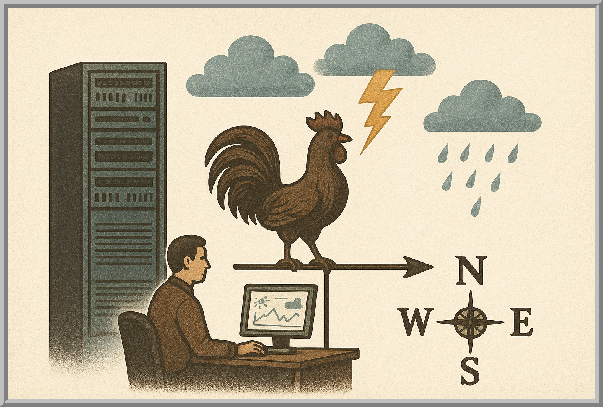
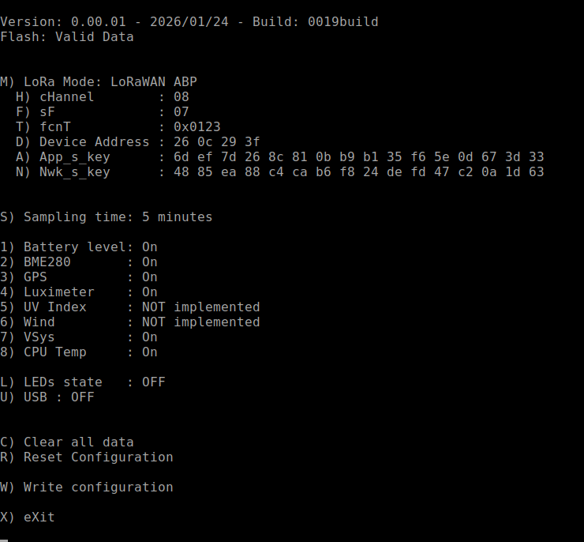
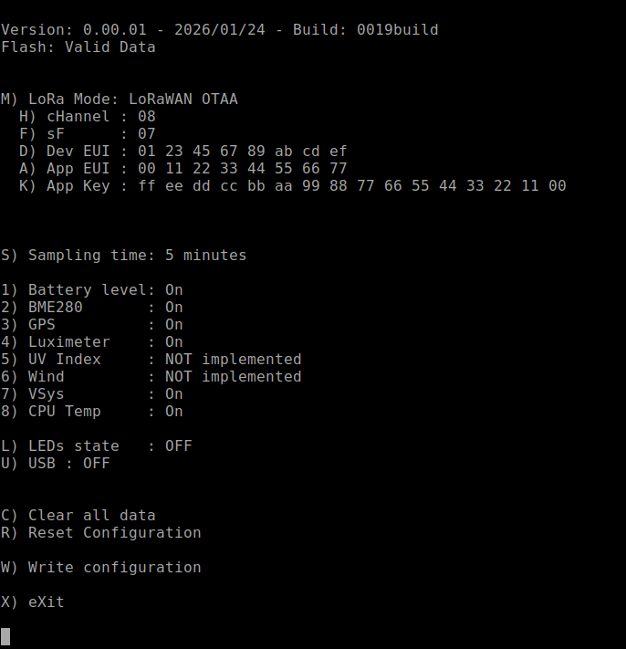
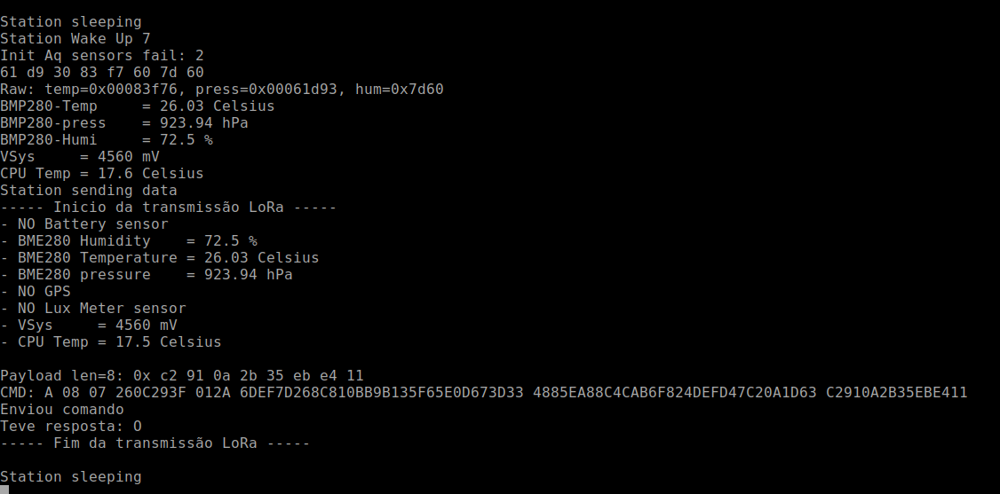

# 📖 Manual do Usuário – Estação Meteorológica para o Agronegócio e a Agricultura Familiar

Autores: **Antonio**, **Carlos** e **Ricardo**

Versão: 0.00.03 de 25/01/2026

## Índice

- [📖 Manual do Usuário – Estação Meteorológica para o Agronegócio e a Agricultura Familiar](#-manual-do-usuário--estação-meteorológica-para-o-agronegócio-e-a-agricultura-familiar)
  - [Índice](#índice)
  - [0. O que você recebeu](#0-o-que-você-recebeu)
  - [1. Instalação dos Módulos](#1-instalação-dos-módulos)
  - [2. Configuração da Estação](#2-configuração-da-estação)
    - [Tela 1 – Configuração Geral da Estação](#tela-1--configuração-geral-da-estação)
    - [2.1 Parâmetros da Estação](#21-parâmetros-da-estação)
    - [2.2 Parâmetros da Comunicação](#22-parâmetros-da-comunicação)
    - [2.3 Definição dos Intervalos e Clock](#23-definição-dos-intervalos-e-clock)
    - [2.4 Sensores I2C Ativos](#24-sensores-i2c-ativos)
    - [2.5 Sensores Digitais Ativos](#25-sensores-digitais-ativos)
    - [2.6 Sensores Analógicos Ativos](#26-sensores-analógicos-ativos)
    - [2.7 Opções de Sistema](#27-opções-de-sistema)
    - [Tela 2 – Ajustes de Data e Hora](#tela-2--ajustes-de-data-e-hora)
    - [2.8 Ajuste de Data e Hora](#28-ajuste-de-data-e-hora)
  - [3. Funcionamento da Estação](#3-funcionamento-da-estação)
    - [3.1 Indicações do LED RGB](#31-indicações-do-led-rgb)
    - [3.2 Indicações do Display da Placa Mãe](#32-indicações-do-display-da-placa-mãe)
    - [3.3 Indicações do Monitor Serial](#33-indicações-do-monitor-serial)
  - [4. Instalação do Servidor](#4-instalação-do-servidor)
  - [5. Uso do Grafana](#5-uso-do-grafana)
    - [5.1 Painéis do Dashboard](#51-painéis-do-dashboard)
      - [Escolha da estação](#escolha-da-estação)
      - [Indicadores em tempo real (Gauges)](#indicadores-em-tempo-real-gauges)
      - [Temperaturas mínimas e máximas do dia](#temperaturas-mínimas-e-máximas-do-dia)
      - [Médias semanais](#médias-semanais)
      - [Mapa das estações](#mapa-das-estações)
      - [Gráfico de históricos](#gráfico-de-históricos)
    - [5.2 Como Acessar o Dashboard](#52-como-acessar-o-dashboard)
  - [6. Especificações Técnicas da Estação](#6-especificações-técnicas-da-estação)
    - [Principais características](#principais-características)
    - [Características dos sensores homologados](#características-dos-sensores-homologados)
    - [Características dos sensores em homologação](#características-dos-sensores-em-homologação)
    - [Especificação do servidor](#especificação-do-servidor)

---

## 0. O que você recebeu
- Uma caixa para a instalação da estação;
- Uma placa da Estação Meteorológica;
- Sensores:
  - BH1750, sensor de luminosidade;
  - BME280, sensor de pressão, temperatura e umidade;
  - GPS, sensor de posição;
- 3 Cabos JST XH de 4 pinos;
- Um Painel Solar;
- Manual de instruções.

---

## 1. Instalação dos Módulos

Para colocar a Estação Meteorológica em funcionamento, instale os módulos segundo os seguintes passos:
   - Conecte os módulos I2C (BH1750 e BME280) na placa da estação com os cabos JST XH de 4 pinos fornecidos;
   - Conecte o GPS na placa da estação com o cabo JST XH de 4 pinos fornecido;
   - Conecte o painel solar a placa da estação atravês do conector KRE;
   - Obs.: Para a configuração inicial será necessário conectar a placa da estação via um cabo usb a um terminal serial.

---

## 2. Configuração da Estação

- A estação meteorológica inicia automaticamente seu funcionamento assim que for energizada.
- Para energizar a estação ligue as chaves na sequinte sequência:
	+ SW2
	+ SW3
	+ Sw1
- Caso queira ajustar os parâmetros da estação use o terminal serial USB. Para isso pressione o botão Config da placa da estação antes de energizá-la (ou de pressionar o botão Reset). Mantenha pressionado o botão Config até que apenas o LED Vermelho fique aceso (demora aproximadamente 10 segundos). Solte o botão Config.
- A configuração é realizada através de **menus textuais** exibidos no monitor serial.
  - O menu permite ajustar parâmetros gerais, de comunicação, os intervalos de coleta de dados e ativar ou desativar os sensores, conforme será descrito a seguir.
- Para configurar os parâmetros da estação, pressione a letra/número correspondente ao item desejadoo. Alguns parâmentros têm seu valor atualizado automaticamente e outros necessitam que se digite o valor desejado seguido de Enter.

### Telas de Configuração Geral da Estação

As imagens abaixo mostram telas do menu:
  
- Quando configurando parâmetros ABP:
  
  
- Quando configurando parâmetros OTAA:
  
---

### 2.1 Parâmetros LoRaWAN

- Para selecionar entre os modos ABP ou OTAA utilize a tecla M  
- Cada modo tem seus próprios parâmetros configuráveis, sendo:  
	+ Modo ABP:
		* Canal  
		* Sf  
		* fcnt
		* Device Address
		* App_s_Key
		* Nwk_s_Key
 	
  + Modo OTAA:
		* Canal  
		* Sf  
		* Dev EUI
		* App EUI
		* App Key

	- Obs.: Em operação normal os parâmetros Canal e Sf devem está em AUTO.  

---

### 2.2 Definição dos Intervalos de Coleta

Selecione a tecka S para escolher os intervalos de coleta entre 10 segundos (apenas para teste) e 1, 2, 5, 10, 15, 20, 30, 45 ou 60 minutos.  

---

### 2.3 Seleção dos Sensores Ativos

- **1) Batery Level** – Ainda não implementado.  
- **2) BME280** – Para medir a umidade relativa, a temperatura e a pressão atmosférica.  
- **3) GPS** – Para medir a latitude, a longitude e altitude.  
- **4) BH1750** – Para medir a luminosidade do ambiente.  
- **5) UV Index** – Ainda não implementado.  
- **6) Wind** – Ainda não implementado.  
- **7) Vsys** – Para medir a tensão de alimentação da placa.  
- **8) CPU temp** – Para medir a temperatura interna do microcontrolador.  

---

### 2.4 Seleçãqo dos Modos de Log (afetam o consumo da estação)

- **L) LEDs state** – Se ativado, os LEDS exibem o estado da estção, ou seja:
  - Sleeping - Estação em modo de baixo consumo.  
  - Coleta - Estação em modo de aquisição de dados dos sensores.  
  - Transmissão - Estação em modo de envio de dados ao gateway.  

- **U) USB** – Para escolher entre os modos do USB:  
  - OFF - Desativa a porta USB,  
  - ON - Mantêm a porta USB sempre ativa.  
  - OFF-ON AUTO - Ativa a USB apenas se a estação está em modo de aquisição ou transmissão de dados.  

---

### 2.5 Opções Adicionais do Menu

- **C) Clear All Data** – Apaga todos os registros locais, **é necessário ser executado na primeira inicialização da estação**.  
- **R) Reset Configuration** – Restaura os parâmetros de fábrica na tela.  
- **W) Write Configuratiom** – Salva as alterações das configurações.
- **X) Exit** – Encerra o menu de configuração e ativa a operação da estação.  

---

## 3. Funcionamento da Estação

# **Texto sob Revisão**

A partir desse ponto o manual está sob revisão para ficar atualizado com o projeto atual.

Após a energização do sistema os LEDs R, G e B pisca rapidamente na sequência vermelho, verde e azul.

Se o botão Config ficar pressionado durante o periodo que os LEDs Verde e Vermelho estiverem acessos a estação entrará em modo de configuração.

### 3.1 Indicações do LED RGB

Durante a operação, os LEDs acessos indicam:
- Verde e Vermelho ==> Inicializando e aguardado se entra ou não no modo configuração (dura uns 10 segundos);
- Vermelho ==> Modo configuração ativo, o menu pode ser acessado pela USB;
- Azul e Verde ==> Saiu do menu e continua a inicialização, periodo bem curto, menos de 1 Wsegundo;
- Vermelho piscando ==> Falha na inicialização dos sensores, estação para.
- Azul ==> estação fazendo a aquisição dos dados dos sensores;
- Azul, Verde e Vermelho ==> Transmitindo os dados
- nenhum LED acesso ==> periodo entre aquisições e transmissão dos dados, a estação está com baixo consumo

---

### 3.2 Indicações do Monitor Serial

Durante a operação da estação, o monitor serial mostra:
- Aquisições efetuadas periodicamente
- Dados enviados para o servidor, bem como o resultado do envio.
- Requisições de atualização do relógio, bem como o resultado da requisição.

---

## 4. Configuração do Gateway

To be wrttrn

---

## 5. Configuração do The Yhings Network (TTN)

To be written

---

## 6. Configuração do TheThingsBoard 

To be written

---

### 6.1 Painéis do Dashboard

**Descrição do exemplo1**

#### Escolha da estação
Selecione a estação que deseja visualizar no painel Device, no canto superior esquerdo do dashboard. Um menu suspenso mostra as estações que tiveram dados colhidos. O dashboard é atualizado instantaneamente.  
#### Indicadores em tempo real (Gauges)
Os três painéis superiores exibem as últimas informações colhidas para temperatura, umidade relativa e pressão atmosférica no local da estação.  
#### Temperaturas mínimas e máximas do dia
O painel de central à esquerda exibe as temperaturas mínima e máxima do dia.  
#### Médias semanais
O painel direito central apresenta as médias semanais, mostrando os valores médios das temperaturas mínima e máxima registradas nos últimos 7 dias da a estação selecionada.  
#### Mapa das estações
No centro do dashboard, o mapa exibe a localização geográfica da estação selecionada.  
#### Gráfico de históricos
O gráfico na parte inferior do dashboard apresenta as séries temporais das medições da estação selecionada, permitindo acompanhar a evolução das temperaturas máxima e mínima, das umidades relativas máxima e mínima e das pressões atmosféricas máxima e mínima dds dados dos últimos 7 dias. A figura abaixo mostra um exemplo do gráfico:

---
### 6.2 Como Acessar o Dashboard

Para ter acesso ao dashboard, siga estes passos:

1. **Abrir o navegador**: a partir de qualquer navegador web, acesse o endereço [http://localhost:3000/login](http://localhost:3000/login). Esse é o **gateway de acesso** ao Grafana, desde que o servidor esteja em execução.

2. **Login no Grafana**: insira o nome de usuário e senha cadastrados para acessar o ambiente do Grafana.

3. **Configurar a fonte de dados (Data Source)**:

   * No menu lateral, selecione **Connections → Data sources**.
   * Clique em **Add data source** e escolha a opção **PostgreSQL**.

4. **Conectar ao banco de dados**: na tela de configuração do PostgreSQL, informe os seguintes dados:

   * **Nome do banco**: o nome definido na instalação/configuração do banco de dados.
   * **Usuário e senha**: credenciais de acesso ao banco.
   * **TLS/SSL**: selecionar a opção **Disabled**.

5. **Salvar e testar**: clique em **Save & test** para verificar se a conexão foi estabelecida corretamente.

6. **Acessar o dashboard**: depois que a conexão com o banco de dados for validada, é possível visualizar os dashboards já configurados. Para isso:

   * No menu lateral do Grafana, clique em **Dashboards**.
   * No canto superior direito da tela, selecione a opção **New → Import**.
   * Escolha o dashboard desejado pelo **nome** na lista disponível ou insira o ID de um dashboard previamente exportado.
   * Clique em **Load** e confirme para abrir o painel e navegar.

---

## 7. Especificações Técnicas da Estação

### Principais características
  
- Placa principal especifica como a placa pico e ...
- Software Build: 0012 ou superior.
- Consumo total médio típico:
	+ WiFi desconectado: 46 mA
	+ WiFi conectado: 70 mA
	+ Transmitindo dados: 97 mA  

  Obs.: Sem sensores AD de alto consumo.

- Duração estimada da bateria sem alimentação solar (periodo de escuro):
  - sem GPS ligado
  - com GPS ligado
	+ Para:
    - Bateria 18650 de 2000 mA hora  
    - Comunicação a cada 5 minutos

- Mecanismo de Integridade: ????
	+ WatchDog com timeout de 45 segundos.

 

### Características dos sensores homologados

| Sensor | Grandeza | Unidade | Range | Precisão | Faixa de Operação |Consumo | Outros |
| --- | --- | --- | --- | --- | --- | --- | --- |
| BMP280 | Pressão | hPa| 300-1100hPa|+-1hPa (de 0 a +40C) | -40 - +85 C | 1120 uA peak | I2C ad=0x76 |
| BMP280 | Temperatura | Celsius | 0 - 65 C| +-1.0 C | |
| AHT10 | Umidade | Relativa | 0 - 100% | +-3% | -40 - 100C| 23 ua | I2C ad=0x38 |
| AHT10 | Temperatura | Celsius | -40 - 80C | +- 0,4 C |
| BH1750 | Luminosidade | lx|0-65535 * | 1.2x  | -40 - +85C | 190 uA | I2C ad=0x23 0x5C |

### Características dos sensores em homologação
Obs.1: Para sua inclusão na estação pode ser necessitar de atualização de firmware e/ou hardware
Obs.2: Como os sensores estão em homologação a tabela abaixo é apenas um indicativo, com valores ausentes em virtude da homologação.

| Sensor | Grandeza | Unidade | Range | Precisão | Faixa de Operação |Consumo | Outros |
| --- | --- | --- | --- | --- | --- | --- | --- |
| HMC5883 | Direção do Vento |Graus| 0-359 graus| 1 grau |-30 - +85C | 100 uA| I2C ad=0x1E |
| --- | --- | --- | --- | --- | --- |
|  | Quantidade de chuva | mm  | --- | --- | --- | --- |
|  | Velocidade do Vento | m/s | --- | --- | --- | --- |
| --- | --- | --- | --- | --- | --- |
| | Índice UV | índice | 0 - 12 | --- | --- | --- | Portas AD de 0 a 8 |

### Especificação do servidor

- Suporte a Docker contêineres 64 bits;
- IP fixo;
- Porta 8080 liberada para acesso externo;
- 1G de memoria Ram disponível para a aplicação;
- 16G de HD para a Aplicação;
- Obs.: as configurações podem ser maiores dependendo do número de estações conectadas, taxa de dados adquiridas e número de dashboards ativos.
