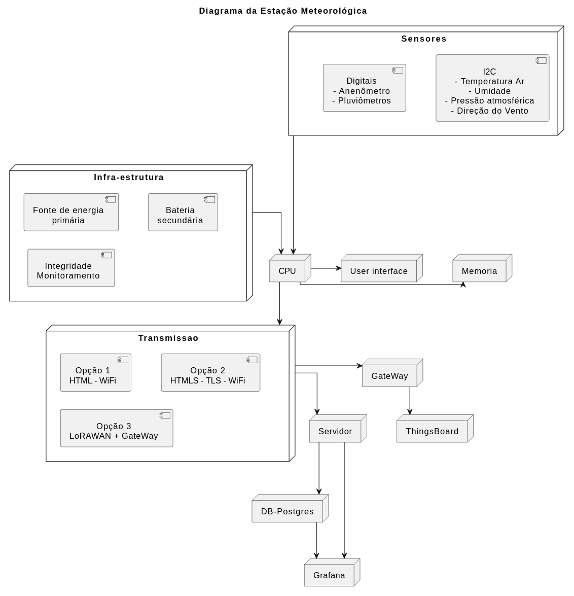

# Relatório — Semana 3  
**Escolha de Hardware e Planejamento para Mudanças**  
**Entrega escrita:** 26/10 **Apresentação:** 27/10

## 1. Objetivo
Selecionar hardware coerente com as especificações iniciais da estação meteorológica IoT e de acordo com a entrevista com o cliente(requisitos), planejar a resiliência a mudanças de componentes/tecnologias e documentar justificação técnica e econômica das escolhas.

---

## 2. Matriz comparativa de hardware

### 2.1 Microcontroladores (unidade de aquisição)

**Escolha recomendada:** *Raspberry Pi Pico 2*, com firmware em C, pois tem baixo custo e bom suporte.

| Característica | **Raspberry Pi Pico** | **Raspberry Pi Pico W** | **Raspberry Pi Pico 2** | **Raspberry Pi Pico 2 W** |
|----------------|-----------------------|--------------------------|--------------------------|----------------------------|
| **Microcontrolador** | RP2040 (Dual-core ARM Cortex-M0+) | RP2040 (Dual-core ARM Cortex-M0+) | RP2350 (Dual-core ARM Cortex-M33 ou RISC-V) | RP2350 (Dual-core ARM Cortex-M33 ou RISC-V) |
| **Frequência de CPU** | 133 MHz | 133 MHz | até 150 MHz | até 150 MHz |
| **Memória Flash** | 2 MB | 2 MB | 4 MB (padrão, expansível) | 4 MB (padrão, expansível) |
| **SRAM** | 264 KB | 264 KB | 520 KB | 520 KB |
| **Conectividade** | Nenhuma | Wi-Fi + BLE (CYW43439) | Nenhuma | Wi-Fi + BLE (CYW43439) |
| **GPIOs disponíveis** | 26 | 26 | 26 | 26 |
| **ADC** | 3 canais (12 bits) | 3 canais (12 bits) | 3 canais (12 bits) | 3 canais (12 bits) |
| **PWM** | 16 canais | 16 canais | 16 canais | 16 canais |
| **Interfaces** | I2C, SPI, UART, USB 1.1, PIO | I2C, SPI, UART, USB 1.1, PIO | I2C, SPI, UART, USB 1.1, PIO | I2C, SPI, UART, USB 1.1, PIO |
| **Suporte a PIO** | Sim (2 blocos) | Sim (2 blocos) | Sim (2 blocos) | Sim (2 blocos) |
| **Tensão de operação** | 1,8–5,5 V | 1,8–5,5 V | 1,8–5,5 V | 1,8–5,5 V |
| **Consumo típico** | 20–90 mA | 50–150 mA (com Wi-Fi) | 20–100 mA | 50–150 mA (com Wi-Fi) | 
| **Dimensões** | 51 × 21 mm | 51 × 21 mm | 51 × 21 mm | 51 × 21 mm |
| **Preço médio (2025)** | R$ 45 | R$ 65 | R$ 55 | R$ 75 |
| **Pontos fortes** | Simplicidade, baixo custo, PIOs poderosos | Wi-Fi integrado, alta estabilidade | CPU mais moderna e rápida | Wi-Fi + novo RP2350 |
| **Limitações** | Sem conectividade | Sem BLE | Ainda sem BLE | Sem BLE |
| **Classificação** | aceitável | aceitável | recomendado | aceitável |

---

### 2.2 Sensores
| Sensor | Medição | Interface | Precisão típica | Faixa | Custo |
|:-:|:--:|:--:|:--:|:--:|:---:|
| BMP180 | Pressão/Temp | I²C / SPI | ±1 hPa / ±1°C | 300–1100 hPa | médio |
| BMP280 | Pressão/Temp | I²C / SPI | ±1 hPa / ±1°C | 300–1100 hPa | baixo |
| BME280 | Pressão/Temp/Umidade | I²C / SPI | ±1 hPa / ±1°C / ±3% | similar | médio |
| AHT10 | Umidade/Temp | I²C | ±3% / ±0.3°C | comum | baixo |
| BH1750 | Luminosidade | I²C | bom para ambiente | 1–65535 lx | baixo |
| Anemômetro (sensor hall) | Velocidade vento | Entrada digital pulsos | depende | 0–60 m/s | baixo |
| Pluviómetro (sensor hall) | Precipitação | Entrada digitall pulsos | contagem por pulso | — | baixo |

**Escolha recomendada:**
- **BMP280:** baixo custo, disponibilidade, precisão.

---

### 2.3 Módulos de rede / Gateway
| Item | Função | Observação |
|:-:|:-:|---|
| RAK7289CV2 (Gateway LoRa) | Gateway LoRaWAN para uplink ao TTN | Recomendado; robusto, multi-channel, compatível TTN |
| Home built Gateway RFM95W + ESP32-C3 | Gateway LoRaWAN para uplink | Necessário desenvolver todo o código |

---

### 2.4 Fontes de alimentação
| Tipo | Vantagens | Desvantagens | Quando usar |
|---|---|---|---|
| Rede elétrica AC para 5V DC | Estável, barato | Não disponível em campo | Estações fixas com rede |
| Bateria recarregável + regulador | Autonomia, remoto | Manutenção, custo | Locais remotos |
| Painel solar + bateria | Autossuficiência | Custo inicial | Locais isolados (recomendado) |

**Escolha recomendada:** *Painel solar + bateria* para estações remotas; rede elétrica quando disponível.

---

## 3. Justificativas técnicas e econômicas

### 3.1 Microcontrolador
- **Técnica:** RP2350 (Pico 2) atende leituras I²C, SPI, PWM, ADC; possui recursos para multitarefa simples e baixo consumo; boa comunidade para drivers de sensores.  
- **Econômica:** Custo unitário baixo (favorável para escalabilidade).
- **Alternativa:** ESP32 tem Wi-Fi/BT mais maduros e maior suporte a TLS se necessário, porém similar custo.

### 3.2 Sensores
- **Técnica:** Os senores escolhidos oferecem precisão adequada ao uso.
- **Econômica:** Possuem baixo custo alinhado aos requisitos do projeto.
- **Alternativa:** O projeto está construído de forma que, se o mercado fornecer alternativas mais atraentes, a sua troca pode ser realizada sem maiores dificuldades.

### 3.3 Rede e gateway
- **Técnica:** O módulo WCM(ESP32-C3 + RFM95W) e o uso do gateway RAK7289CV2, se mostraram eficientes para permitir a construção de uma rede LoRaWAN de estações meteorológica, como mostrou o  desenvolvimento do grupo da FEEC Unicamp.  
- **Econômica:** Custo do gateway é amortizado quando se atende várias estações.
- **Alternativa:** Utilizar, nos dispositivos IoT, o módulo RFM95W, controlado diretamente pela placa pico 2 e, para o gateway, utilizar uma solução home-built com ESP32-C3 + RFM95W.

### 3.4 Energia
- **Técnica:** O painel solar permite que a estação fique autônoma em relação à fonte de energia externa.  
- **Econômica:** O custo pode ser menor que uma instalação elétrica em lugares remotos.
- **Alternativa:** Gerador eólico ou instalação elétrica dedicda.

---

## 4. Plano de abstração de hardware (HAL)

### 4.1 Objetivo do HAL
Criar interfaces genéricas que desacoplem a lógica do sistema dos componentes físicos, permitindo trocar sensores e módulos de comunicação sem alterar a camada de aplicação.

### 4.2 Estratégia utilizada  
Os sensores do projeto têm uma interfaze (API) padrão composta de inicialização (init()) e aquisição de dados (read()). Desta forma, a troca de sensores pode ser realizada sem alterar a estrutura principal do firmware.

### 4.3 Benefícios  
- Troca de hardware reduz impacto no firmware (apenas trocar driver).
- Testes unitários isolados por interface.
- Reuso de código para múltiplas plataformas (RP2040 / Rp2350 / ESP32).

---

## 5. Análise de riscos de substituição e mitigação

### Riscos principais
1. **Obsolescência de sensores (EOL)** — fornecedor descontinua componente.  
   - *Mitigação:* projeto modular com HAL; manter lista de equivalentes.  

1. **Gateway/Rede indisponível (TTN down / gateway com defeito)**  
   - *Mitigação:* Manter backup dos dados em flash(storage circular) no dispositivo IoT.

1. **Interferência/ruído em leituras** (ambiente campo)  
   - *Mitigação:* condicionamento de sinal, filtros RC e aterramento adequado.

---

## 6. Diagrama consolidado do sistema

---

## 7. Conclusão
A arquitetura proposta combina **RP2350 (Pico 2)** em  nós, sensores consolidados (como exemplo BMP280), energia solar para autonomia e o **RAK7289CV2** como gateway LoRaWAN para integração com o **TTN**. O projeto é modular por meio de uma API para sensores padrão, equivalente a implementanção de um HAL adequado, facilitando substituições e escalabilidade. As escolhas tentam equilibar custo, desempenho e robustez operacional. As mitigações de riscos propostas objetivam acegurar continuidade e facilidade de manutenção do projeto.
