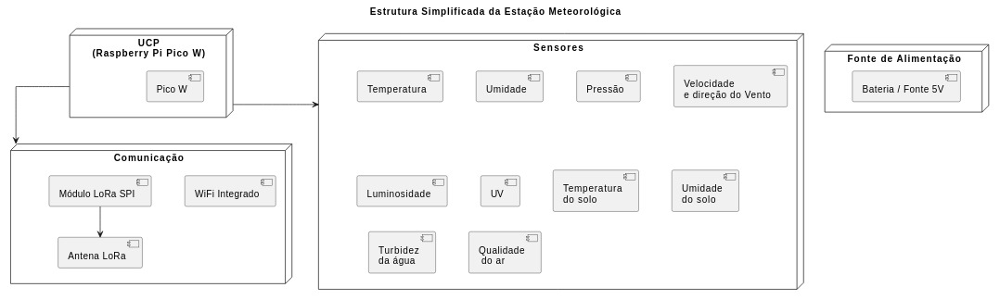

# EMBARCATECH - FASE 2

## PROJETO FINAL - ESTAÇÃO METEOROLÓGICA

Autores: Carlos Martinez Perez e Ricardo Jorge Furlan

### ETAPA 1:

#### INTRODUçÃO

- Agronegócio: adoção de novas tecnologias- Agricultura 4.0 ou Agricultura de Precisão.  
- Capacidade de coletar e analisar dados do microclima em tempo real.  
- Objetivo: desenvolvimento de uma estação meteorológica inteligente, autônoma, escalável e conectada.  
- Justificativa: tomada de decisões operacionais no planejamento e na gestão do negócio, permitindo:  
    - Otimização da Irrigação.  
    - Manejo Inteligente de Culturas.  
    - Redução de Custos e do Impacto Ambiental.  
    - Aumento da Produtividade e Resiliência.  
- Mitigação dos problemas:  
    - Irrigação Ineficiente.  
    - Perdas de Safra.  
    - Falha na otimização de Insumos.  
    - Planejamento Agrícola Subjetivo.  

#### IDENTIFICAÇÃO DO PROBLEMA

    - Desafios na tomada de decisão.  
    - Carência de dados microclimáticos.  
    - Dados localizados e em tempo real.  
    - Resultando em:  
        - Irrigação Ineficiente.  
        - Perdas de Safra.  
        - Falha na otimização de Insumos.  
        - Planejamento Agrícola Subjetivo.  

#### REQUISITOS

- Funcionais (o que é desejável, independente de ser implementado):  
    - Temperatura do ar.  
    - Temperatura do solo.  
    - Umidade relativa do ar.  
    - Pressão atmosférica.  
    - Luminosidade.  
    - Intensidade UV.  
    - Velocidade do vento.  
    - Direção do vento.  
    - Volume de chuva (precipitação).  
    - Umidade do solo.  
    - Qualidade do ar.  
    - Detecção de descargas elétricas.  
    - Coleta e armazenamento de dados.  
    - Transmissão de dados.  
    - Visualização e análise de dados.  
    - Gerenciamento de erros.  

- Não Funcionais:  
    - Modularidade.  
    - Escalabilidade.  
    - Autonomia energética.  
    - Robustez física e resistência à intempéries.  
    - Manutenibilidade.  
    - Segurança (básica).  

#### LISTA INICIAL DE MATERIAIS

#### DIAGRAMA ESTRUTURAL

#### EXPLICAÇÃO SOBRE A ESTRUTURA

#### FLUXOGRAMA DO SOFTWARE

