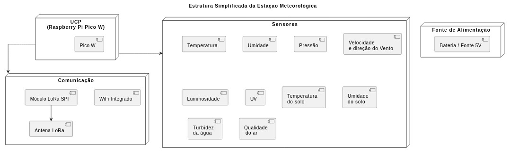

# EMBARCATECH - FASE 2

## PROJETO FINAL - ESTAÇÃO METEOROLÓGICA

Autores: Carlos Martinez Perez e Ricardo Jorge Furlan

### ETAPA 1:

#### INTRODUÇÃO

- Agronegócio: adoção de novas tecnologias- Agricultura 4.0 ou Agricultura de Precisão.  
- Capacidade de coletar e analisar dados do microclima em tempo real.  
- Objetivo: desenvolvimento de uma estação meteorológica inteligente, autônoma, escalável e conectada.  
- Justificativa: tomada de decisões operacionais no planejamento e na gestão do negócio, permitindo:  
    - Otimização da Irrigação.  
    - Manejo Inteligente de Culturas.  
    - Redução de Custos e do Impacto Ambiental.  
    - Aumento da Produtividade e Resiliência.  
- Mitigação dos problemas:  
    - Irrigação Ineficiente.  
    - Perdas de Safra.  
    - Falha na otimização de Insumos.  
    - Planejamento Agrícola Subjetivo.  

#### IDENTIFICAÇÃO DO PROBLEMA

- Desafios na tomada de decisão.  
- Carência de dados microclimáticos.  
- Dados localizados e em tempo real.  
- Resultando em:  
    - Irrigação Ineficiente.  
    - Perdas de Safra.  
    - Falha na otimização de Insumos.  
    - Planejamento Agrícola Subjetivo.  

#### REQUISITOS

- Funcionais (o que é desejável, independente de ser implementado):  
    - Temperatura do ar.  
    - Temperatura do solo.  
    - Umidade relativa do ar.  
    - Pressão atmosférica.  
    - Luminosidade.  
    - Intensidade UV.  
    - Velocidade do vento.  
    - Direção do vento.  
    - Volume de chuva (precipitação).  
    - Umidade do solo.  
    - Qualidade do ar.  
    - Detecção de descargas elétricas.  
    - Coleta e armazenamento de dados.  
    - Transmissão de dados.  
    - Visualização e análise de dados.  
    - Gerenciamento de erros.  

- Não Funcionais:  
    - Modularidade.  
    - Escalabilidade.  
    - Autonomia energética.  
    - Robustez física e resistência à intempéries.  
    - Manutenibilidade.  
    - Segurança (básica).  

#### LISTA INICIAL DE MATERIAIS

- Sensores:  

| Quantidade | Componente                                | Utilidade                                 |
|------------|-------------------------------------------|-------------------------------------------|
| 1          | BME680 (Nota 1)                           | Pressão, Temperatura, Umidade, Qualidade do Ar |
| 1          | BME280 (Nota 1)                           | Pressão, Temperatura, Umidade             |
| 1          | BMP280 (Nota 1)                           | Pressão, Temperatura                      |
| 1          | ATH10                                     | Umidade, Temperatura                      |
| 1          | Catavento com magneto + HMC5883 (ou sensor hall switch) | Velocidade do Vento                       |
| 1          | Biruta com magneto + HMC5883              | Direção do Vento                          |
| 1          | BH1750                                    | Luminosidade                              |
| 1          | GY33                                      | Luminosidade "espectral"                  |
| 1          | GUVA-S12SD                                | Índice UV                                 |
| 1          | UVM-30A                                   | Índice UV                                 |
| 3          | DS18B20 à prova d'água                    | Temperatura do Solo                       |
| 3          | SEN0193                                   | Umidade do Solo                           |
| 1          | TS-300B + MCP6002                         | Turbidez da Água                          |
| 1          | RS-GYL-*-1-EX ou RS-YL-*-2-EX             | Pluviômetro                               |
| 1          | MQ-131                                    | Qualidade do Ar - Ozônio                  |
| 1          | MICS-6814                                 | Qualidade do Ar - CO, NH3, NO2            |
| 1          | NHZ-14A                                   | Qualidade do Ar - CO2                     |

Nota 1: Será utilizado apenas um dos três sensores (BME680, BME280 ou BMP280) para pressão, temperatura e umidade, mas o sistema será compatível com todos eles.  
Obs.: Nem todos os sensores serão implementados num primeiro momento do desenvolvimento, sendo apenas uma previsão para a estruturação do projeto.  

- Diversos:  

| Quantidade | Componente                          | Utilidade              |
|------------|-------------------------------------|------------------------|
| 1          | BitDogLab V6.3                      | CPU                    |
| 1          | RTC DS3231 ou RTC DS1302 ou RTC DS1307 | RTC - Real Time Clock |
| 1          | Cartão de memória                   | Armazenamento temporário |
| 1          | Cartão de expansão 12C com cabos     |                        |
| 1          | Módulo Lora                         | Comunicação            |
| 1          | Fonte 5V                            |                        |
  
#### DIAGRAMA ESTRUTURAL

  
#### EXPLICAÇÃO SOBRE A ESTRUTURA
  
#### FLUXOGRAMA DO SOFTWARE
  